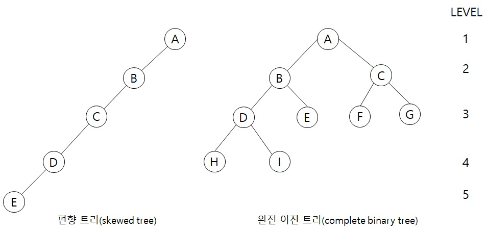
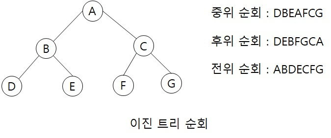

# 이진 트리(binary tree)

이진트리(binary tree)는 공백이거나 루트와 왼쪽 서브트리, 오른쪽 서브트리라고 하는  
2개의 분리된 이진 트리로 구성된 노드의 유한 집합입니다.  

위 그림의 편향 트리는 왼쪽으로 편향된 왼쪽 편향 트리인데,   
반대인 오른쪽으로 편향된 오른쪽 편향 트리도 있습니다.  
그런데 이러한 경우는 한쪽으로만 편향되어 있기 때문에 그다지 좋은 현상이 아닙니다.  
이러한 경우라면 구지 트리 구조를 사용할 필요 없이 배열을 사용하는게 훨씬 더 이득일것입니다.  
그리고 나머지 하나 완전 이진 트리는 위 그림처럼 자식이 꽉차 있는 경우를 하는데,  
이러한 경우가 트리 구조를 제대로 활용하는 경우라고 합니다.  

## 이진 트리 순회  
트리에서 수행하는 여러가지 연산 중 하나가 트리 순회(tree traversal), 즉  
트리에 있는 모든 노드를 한번씩만 방문하는 것입니다.  
그러기 위해서 순회 방식은 3가지가 있습니다.  
- 중위(inorder) 순회 : 왼쪽 서브트리 -> 루트 -> 오른쪽 서브트리  
더 이상 진행 할 수 없을 때까지 왼쪽 방향으로 이동한 다음, 그 노드를 방문하고  
오른쪽 자식 노드로 이동을 한뒤 계속 진행을 합니다.  
만약 오른쪽으로 이동을 할 수 없다면 한 노드 위로 돌아갑니다.  

- 후위(postorder) 순회 : 왼쪽 서브트리 -> 오른쪽 서브트리 -> 루트  
더 이상 진행 할 수 없을 때까지 왼쪽 방향으로 이동한 다음   
더 이상 계속 진행할 수 없으면 오른쪽으로 이동하여 다시 왼쪽으로 진행하거나,  
오른쪽으로 이동한 후 루트 노드를 방문합니다.  

- 전위(preorder) 순회 : 루트 -> 왼쪽 서브트리 -> 오른쪽 서브트리  
노드를 먼저 방문하고 왼쪽으로 가서 계속 진행을 합니다.  
그리고 더 이상 계속 진행할 수 없으면 오른쪽으로 이동하여 다시 왼쪽으로 진행하거나,  
오른쪽으로 이동하여 순회를 계속 할 수 있을때까지 되돌아 갑니다.  

참고 문헌 : C로 쓴 자료구조론
