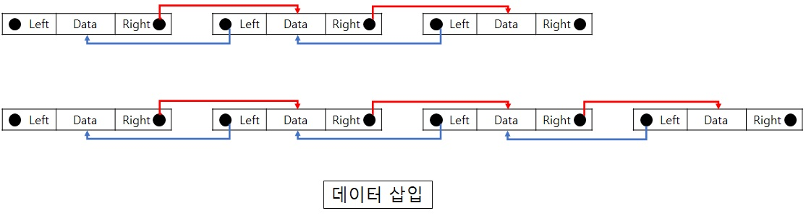
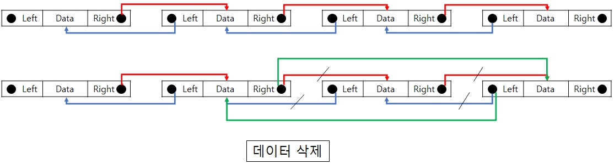
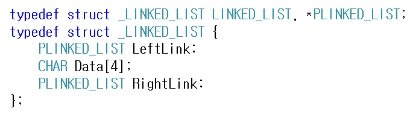
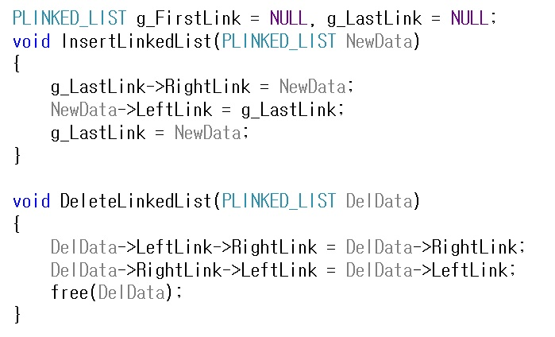

# 이중 연결 리스트(Doubly Linked List)

기존 단일 연결 리스트는 현재 방향에서 순차적으로 연결된 방향으로만 진행을 할 수 있다는 단점이 있습니다.  
만약 현재 데이터의 앞에 데이터를 알고 싶은 경우에는 데이터를 다시 처음부터   
순차적으로 탐색해서 찾는 방법 이외에는 방법이 없습니다.  
그래서 단일 연결 리스트에서 임의의 데이터 삭제를 할 때 삭제할 데이터의 이전 링크를 알아야 하는데  
다음 링크만 알고 있기 때문에 문제가 발생을 하게 됩니다.  
또한 현재 데이터에서 앞방향으로 갈지 뒷방향으로 가야 할 상황이 생길 수도 있는데 이럴 때도 문제가 발생합니다.  
따라서 이러한 문제를 해결하기 위해서 양 방향으로 이동이 가능하도록 앞,뒤 링크를 전부 가지는  
이중 연결 리스트(Doubly Linked List)가 등장을 하였습니다.  
이중 연결 리스트(Doubly Linked List)는 기존 단일 연결 리스트에서 앞링크를 저장하는 포인터 구조체 변수를  
하나 더 가지게 됨으로써, 왼쪽링크(LeftLink), 오른쪽링크(RightLink) 그리고 데이터(Data) 총 3개를 가지게 됩니다.  

위 그림에서 보면 데이터를 삽입 할 때 양방향으로 연결해 줌으로써 삽입이 완료 되는것을 확인 하실 수 있습니다.  

마찬가지로 데이터 삭제 시에는 현재 삭제하는 데이터의 Right가 가리키는 데이터를 이전 데이터가  
가리키도록 변경하고 현재 삭제하는 데이터의 Left가 가리키는 데이터를 이후 데이터가 가리키도록   
연결해 줌으로써 삭제가 완료되는 것을 확인 하실 수 있습니다.     

따라서 이중 연결 리스트를 구조체로 표현을 하면 위와 같이 2개의 구조체 포인터를 가지게 됩니다.  
여기서 단점은 기존 단일 연결리스트에서는 구조체 포인터를 1개만 가지고 있었지만,  
이중 연결 리스트에서는 구조체 포인터가 1개 더 추가되어 총 2개가 됨으로써 메모리를 더 사용하게 되며,  
추가적으로 양방향을 연결해줘야 하는 처리 부분에서 조금 더 구현 복잡도가 높아집니다.  
하지만 구현만 잘 한다면 얻는 이득이 더 큼으로써 많이 사용되고 있습니다.   

위 소스코드는 기본적으로 삽입과 삭제에 대해서 나타냅니다.  
단방향 삽입에 대해서만 기본적으로 구현하였으나 필요한 상황에 맞춰서 구현시에는 달라질 수 있습니다.  
데이터의 중간, 처음, 끝 부분에 삽입 시 다양한 조건들이 설정되어야 하는 부분은 일단 고려하지 않고 구현을 하였습니다.  
그리고 여기서 전역변수 g_FirstLink, g_LastLink 가 있는데, 이거는 이중 연결 리스트의   
첫 번째 데이터 위치(head)와 마지막 데이터 위치(tail)로 보실 수 있습니다.  
그리고 이 head와 tail을 이용해서 데이터의 추가 또는 삭제를 수행 할 때 head 또는 tail 에서 삽입, 삭제가  
이루워 질 수 있으며, 데이터의 탐색시에도 head 또는 tail에서부터 탐색을 진행할 수도 있습니다.  

참고 문헌 : C로 쓴 자료구조론