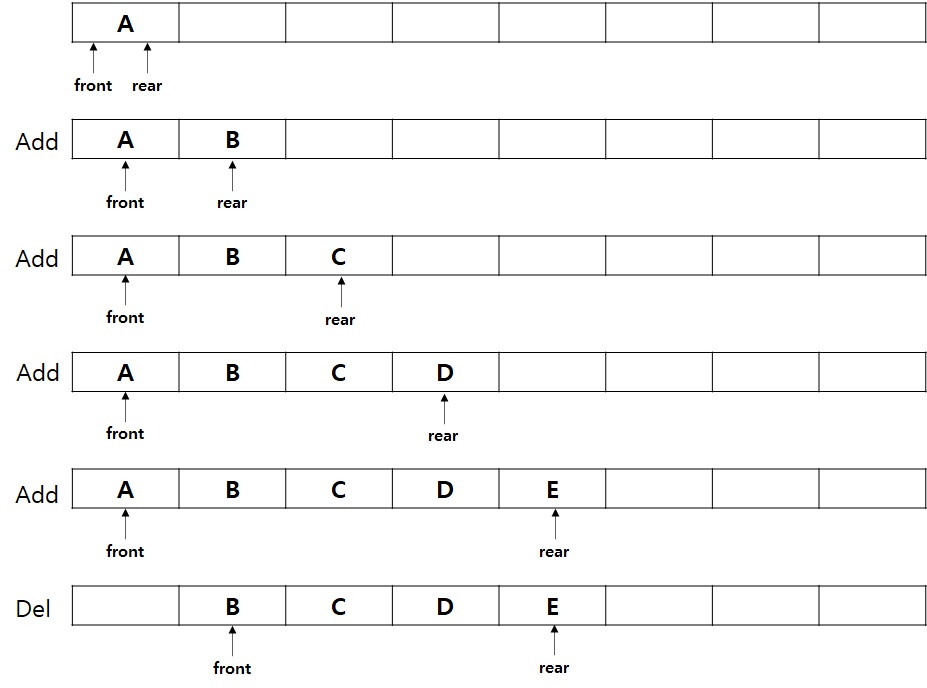
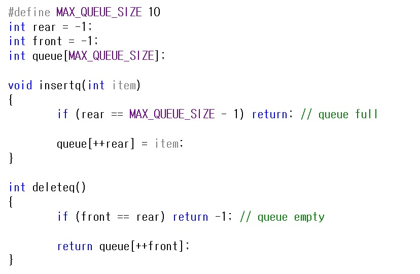
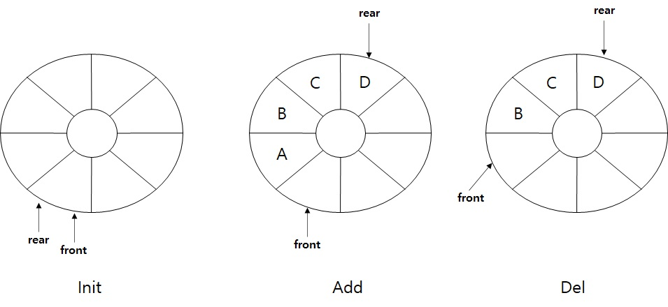
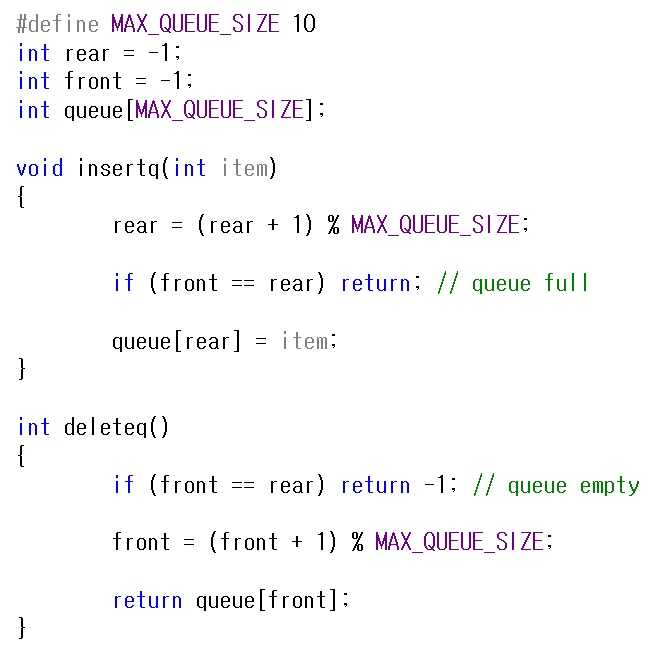

# 큐(Queue)

큐는 한쪽 끝에서 삽입(Insert)이 일어나고 그 반대쪽 끝에서 삭제(Delete)가 일어나는 순서 리스트 입니다.  
새로운 데이터가 삽입되는 끝을 rear(tail) 라고 하고, 삭제되는 끝을 front(head) 라고 합니다.  
따라서 큐는 선입선출(FIFO, First-In-First-Out) 리스트라고 합니다.  
큐에 데이터가 A,B,C,D,E 가 차례대로 삽입 된다면, rear는 E에 위치하고, front는 A에 위치하게 됩니다.  
큐는 보통 프린터의 인쇄 대기열 같이 먼저 들어오는 순서대로 처리해야 할 때 사용합니다.  
실생활에서는 대기표를 뽑고 기다리는 상황을 이야기 할 수도 있을거 같습니다.  

그렇다면 이제 큐를 프로그램 C언어로 표현을 해보도록 하겠습니다.  

위 방법은 배열을 이용한 큐를 구현하였습니다.     
여기서 큐에 데이터가 삽입 될 수록 rear의 위치는 점차 오른쪽으로 이동하게 됩니다.  
그리고 데이터가 삭제 될 수록 역시 front의 위치도 오른쪽으로 이동하게 됩니다.  
그렇게 되면 앞에 있는 메모리의 공간은 사용을 못하게 되는 치명적인 단점이 발생하게 됩니다.  
그래서 이걸 해결 하기 위해서 큐를 원으로 만들어서 뱅글뱅글 돌면서   
메모리를 효율적으로 사용할 수 있도록 해줍니다.  
이것을 원형 큐(Circular Queue) 라고 합니다.  

그렇다면 이제 원형 큐를 프로그램 C언어로 표현을 해보도록 하겠습니다.  

이렇게 원형으로 연결을 해주면 기존의 큐에서 발생하는 문제를 해결할 수 있습니다.  

참고문헌 : C로 쓴 자료구조론

