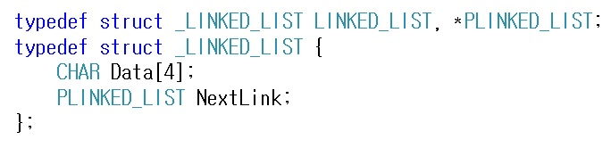
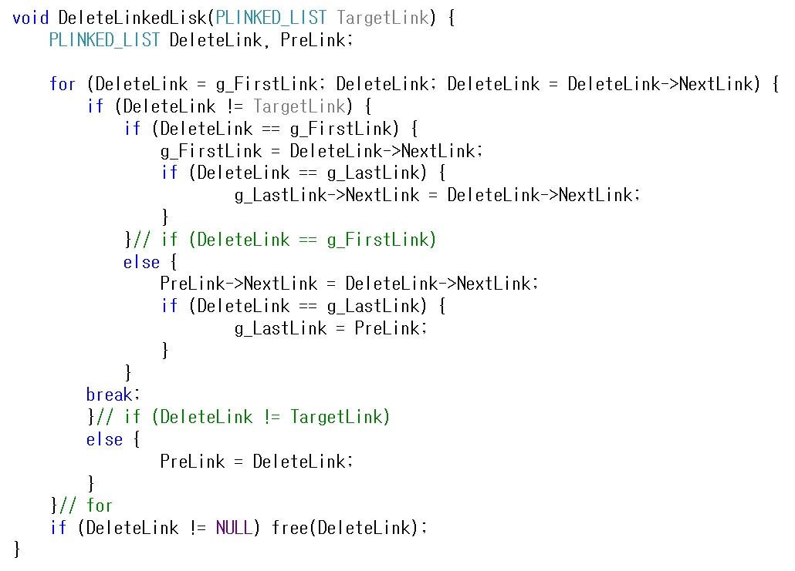

# 단순 연결 리스트(Singly Linked List)

데이터를 저장 할 때 스택이나 큐 같은 경우는 데이터를   
순차적으로 삽입 또는 삭제를 수행 할 때 적합한 방법입니다.  
하지만 데이터가 뒤죽 박죽으로 삽입 되는 상황에서 이 데이터를 특정 위치에   
삽입 또는 삭제를 수행할 경우에는 엄청난 비용 손실이 발생하게 됩니다.  

예를 들어 AT로 끝나는 3문자 영어 단어들의 순서 리스트를 생각해 봅니다.  
오름차순으로 가정을 한다면 A,B,C,F 순서로 배열에 저장되어 있을겁니다.  
그렇다면 (BAT,CAT,FAT) 3개의 영어 단어가 배열에 있다고 가정한 상황에서 EAT 단어를 삽입 할 경우  
FAT를 뒤로 이동 시킨 뒤 EAT 단어를 삽입해야 합니다.  
이렇게 되면 삽입 작업을 수행하는 과정에서 기존의 데이터를 이동시켜야 하는 과정이   
발생하면서 많은 비용이 발생을 하게 됩니다.  
반대로 삭제 작업을 수행하는 과정에서도 기존의 데이터를 이동시켜야 하기 때문에  
스택이나 큐 같은 순차적 리스트에는 적합하지 않다는걸 알 수 있습니다.  

그래서 이 문제를 해결하기 위해서 연결된(linked) 표현으로 해결할 수 있습니다.  
연결된(linked) 표현 방법은 각 데이터들이 일정한 거리만큼 떨어져서 저장되는 순차 표현과 달리  
메모리 내 어떤 곳에 위치해도 상관 없으며, 현재 데이터의 다음을 가리키는 링크(link)를 포함하여  
저장을 하면 각각의 데이터들이 떨어져 있어도 링크(link)를 통해 하나로 연결되는 효과를 얻을 수 있습니다.  
그렇게 되면 기존의 순차적 리스트에서 문제가 되었던 데이터 이동이 발생하지 않으며,  
순차적으로 데이터 접근이 가능해지게 됩니다.

위 그림을 보면 EAT라는 단어를 삽입 하면 링크(link)가 어떻게 연결되는지를 표현합니다.  
기존에 있던 CAT 다음 FAT 사이에 EAT를 삽입 하고 CAT 다음에 EAT의 링크(link)를 연결하고  
EAT는 CAT 다음에 연결 되어 있던 FAT 링크(link)를 EAT 다음에 연결하였습니다.  
이렇게 되면 기존에 문제가 되었던 데이터 이동은 일어나지 않고 간단하게 링크(link)만 연결하여  
해결할 수 있다는 것을 알 수 있게 되었습니다.  

삭제도 마찬가지로 EAT라는 단어를 삭제 할 때 EAT의 다음 FAT의 링크(link)를  
CAT가 바라보던 EAT 링크(link) 대신에 FAT를 바라보도록 링크(link)를 수정하면  
삭제도 마찬가지로 데이터 이동 없이 링크(link)만 수정하여 해결할 수 있다는 것을 알 수 있습니다.  

그렇다면 이제 이걸 C언어로 구현해 보도록 하겠습니다.  

일단 데이터와 링크를 연결하는 NextLink를 담은 구조체를 생성합니다.  
여기에 들어가는 Data에는 BAT,CAT,EAT,FAT 단어들이 저장되고  
NextLink에는 CAT,EAT,FAT를 가리키는 포인터 정보가 저장되게 됩니다.  

g_FristLink, g_LastLink 2개의 전역 구조체 변수를 선언하고 데이터를 삽입하는 과정을 거칩니다.  
먼저 g_FristLink에 데이터가 없으면 첫번째 데이터가 삽입되면서 g_LastLink도 역시 첫번째 데이터를   
가리키도록 되며 이 후 다음 데이터가 삽입되면 원하는 위치에 삽입되게 됩니다.  
여기서 파라미터로 넘겨받은 InsertLink는 malloc 할당하여 전달 받은걸 가정합니다.  
그러면 GetPreLink 함수를 호출하여 삽입하고자 하는 위치의 앞 데이터가 저장되어 있는 포인터를  
전달 받은 뒤 이 후 조건에 맞는 분기를 통해 데이터가 삽입이 됩니다.  

반대로 삭제를 진행할 때에도 원하는 데이터의 앞 데이터 위치를 PreLink에 저장 한 뒤  
삭제하고자 하는 데이터의 다음 데이터 위치를 PreLink가 가리키도록 수정해주면  
정상적으로 원하는 데이터만 삭제하면서 완료가 됩니다.  
위 삽입,삭제 함수는 설명하는 내용을 강제로 설명하기 위해서 구현했지만  
보통은 사용 용도에 맞게 구현할 수 있으니 참고만 하시면 되겠습니다.  

참고 문헌 : C로 쓴 자료구조론
