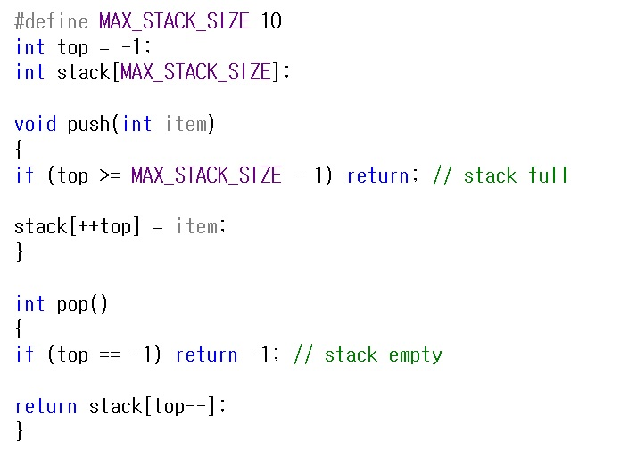
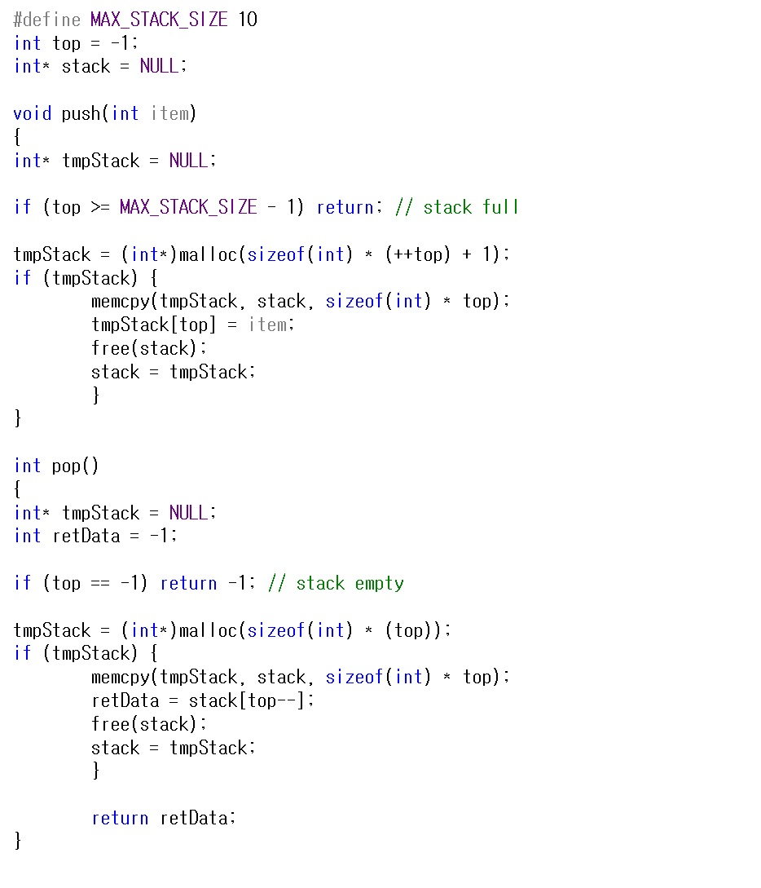

# 스택 (Stack)

스택은 top 이라고 하는 한쪽 끝에서 삽입과 삭제가 일어나는 순서 리스트 입니다.  
스택은 후입선출 (LIFO, Last-In-First-Out) 리스트라고도 합니다.  
따라서 데이터 A,B,C,D,E를 순서대로 스택에 삽입을 했다면   
가장 먼저 삽입이 되는거는 A 이며 마지막에는 E가 삽입이 됩니다.  
반대로 가장 먼저 삭제가 되는 데이터는 E 이고, 가장 마지막에 삭제가 되는거는 A 입니다.  

위 그림처럼 스택의 사용 예로 웹 브라우저에서 우리가 가장 많이 사용하는 뒤로가기 기능 입니다.  
그 외에도 실행취소 (ctrl + z) 같은 기능에도 사용되기도 하며,   
재귀 알고리즘을 사용하는데 있어서도 사용 됩니다.  

그리고 프로그램 실행 시 함수 호출을 처리하기 위해서도 시스템에서는 스택을 사용합니다.  
함수가 호출될 때마다 프로그램은 스택 프레임(stack frame)이라는   
구조를 생성하고 시스템 스택의 top에 둡니다.  
그리고 호출된 함수의 활성 레코드는 이전의 스택 프레임에 대한 포인터와 복귀 주소만 가지고 있습니다.  
이전의 스택 프레임 포인터는 호출한 함수의 스택 프레임을 가리키고,   
복귀 주소는 함수가 종료된 후에 실행되어야 하는 명령문 위치를 가리킵니다.  

위 그림처럼 func1을 호출하는 함수가 있을 때 func1를 호출하기 전 시스템 스택과  
func1을 호출한 후 시스템 스택을 간략하게 표현하였습니다.  

그렇다면 이제 스택을 프로그램 C언어로 표현을 해보도록 하겠습니다.  

위 방법은 배열을 이용한 스택을 구현하였습니다.   
이 구현의 단점은 스택이 얼마나 크게 될지 그 범위를 사전에 미리 예측하고 메모리를 할당해야 합니다.  
하지만 이 단점을 극복하는 방법이 있는데 바로 메모리를 동적으로 할당하는 방법이 있습니다.  
그렇게 되면 스택의 크기를 미리 예측할 필요 없이 사용할 때마다,   
동적 할당을 통해 메모리를 효율적으로 사용할 수도 있습니다.  

이 후에 정리할 링크드리스트 자료구조를 통해서도 구현할 수 있으나   
지금은 동적 할당에 초점을 두고 구현해서 다소 억지스러움이 있는거 같긴 히지만..   
그래도 동적 할당을 통해서 메모리를 효율적으로 사용할 수 있다는 부분을 확인할 수 있습니다.  

참고 문헌 : C로 쓴 자료구조론

