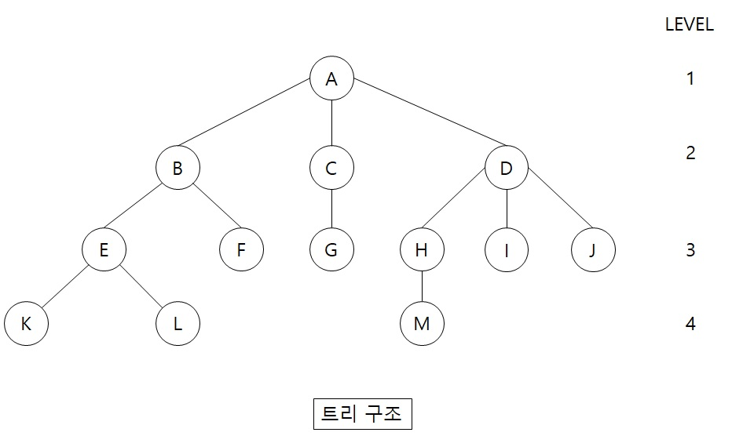
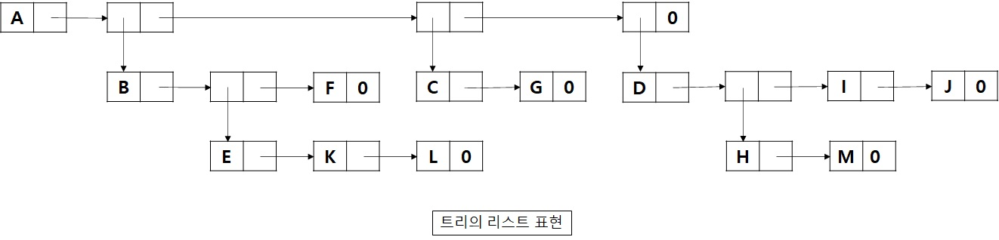
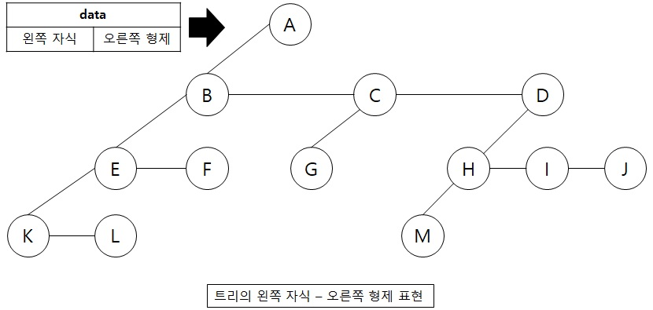
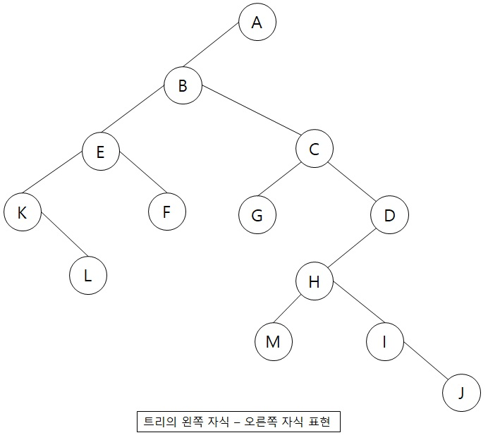
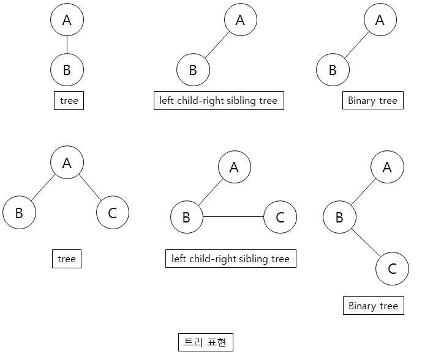

# 트리(Tree)

트리(Tree) 구조란, 정보의 항목들이 가지(branch)로 연결될 수 있게 데이터가 조직되는 것을 말합니다.  
트리(Tree)는 1개 이상의 노드로 이루어진 유한 집합으로써 노드(node)는   
한 정보 아이템에 다른 노드로 뻗어진 가지를 합친 것을 의미합니다.  
그리고 한 노드의 서브트리의 수를 그 노드의 차수(degree)라고 합니다.  

위 그림을 설명하면 다음과 같습니다.  
먼저 A는 루트라고 하며, A의 차수는 B,C,D 총 3이고, C의 차수는 G 총 1이 되며, F의 차수는 0 입니다.  
차수가 0인 노드를 리프(leaf) 또는 단말 노드(terminal node)라고 합니다. (즉, 자식이 없는 노드)  
그리고 맨 마지막에 위치한 K,L,F,G,M,I,J는 리프 노드들의 집합이라고 하며,   
나머지 노드들은 비단말 노드(non-terminal node)라고 합니다.   
여기서 노드 X의 서브트리의 루트들은 X의 자식(children)이고, X는 그 자식들의 부모(parent)입니다.  
따라서 B의 자식은 E,F이며, 부모는 A 입니다.   
여기서 E와 F는 부모가 같은 B이기 때문에 형제(sibling)라고 합니다.  
그리고 K와 L의 조부모는 B입니다.  
그리고 노드의 조상(ancestors)이라 하면 루트에서부터 그 노드에 이르는 경로상에 있는 모든 노드를 이야기 합니다.  
따라서 M의 조상은 A->D->H 가 됩니다.  

노드의 레벨(level)은 루트의 레벨을 0 또는 1로 정한 뒤에 정의 됩니다.  
만약 한 노드의 레벨이 X이면 그 자식의 레벨은 X+1이 됩니다.  
따라서 위 그림에서 보면 트리의 모든 레벨을 보여주고 있습니다.   
그리고 트리의 높이(height)또는 깊이(depth)는 그 트리에 속한 노드의 최대 레벨을 정의하는데,  
A는 1레벨, B,C,D는 2레벨, E,F,G,H,I,J는 3레벨, K,L,M은 4레벨이 됩니다.  
그리고 E의 깊이(depth)는 A->B->E 총 2가 됩니다.  
 

## 트리의 리스트 표현

(A (B (E (K, L), F), C(G), D (H (M), I, J) ) )  
위 표현식은 루트 노드 정보가 제일 먼저 나오고 서브트리들의 리스트가 그 다음에 나옵니다.   
아래 그림은 처음 표현된 트리 구조 그림을 메모리 상태로 표현하였습니다.  

## 트리의 왼쪽 자식-오른쪽 형제 표현

위 그림은 모든 노드가 하나의 가장 왼쪽 자식(left child)과 가장 가까운 오른쪽 형제(right sibling)를 가진다는걸 표현하였습니다.  
A의 가장 왼쪽 자식은 B이며, B의 가장 왼쪽 자식은 E 입니다. 그리고 가장 가까운 B의 형제는 C가 됩니다.  
마찬가지로 D의 왼쪽 자식은 H가 되며, H의 왼쪽 자식은 M이 됩니다. 그리고 가장 가까운 H의 형제는 I가 됩니다.  

## 트리의 차수-2인 표현

위 그림은 트리를 차수-2인 트리로 만들기 위해서 왼쪽 자식과 오른쪽 형제 트리로만 표현을 하였습니다.  
따라서 각 노드는 왼쪽 자식과 오른쪽 자식이라고 할 수 있습니다.   
이 때 루트 A의 오른쪽 자식은 공백 입니다. 왜냐하면 루트는 형제를 가질 수 없기 때문에 
항상 루트 노드의 오른쪽 자식은 공백이 되며, 이런걸 이진 트리(binary tree)라고도 합니다.  

참고 문헌 : C로 쓴 자료구조론

