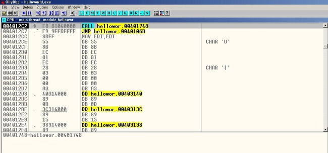
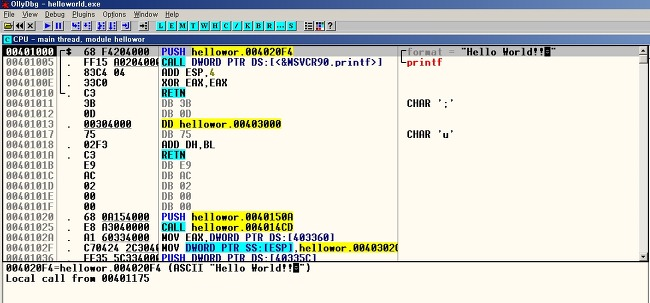

# Reversing 첫 걸음

첫술에 배부르랴 라는 말이 있듯이, 처음부터 너무나 욕심을 가지고 공부를 하려고 하면 금방 질리게 됩니다.  
저 역시도 처음부터 많은것을 알려고 하는 아주 못된 성격을 가지고 있습니다.  
하지만 이번에는 아주 오랜시간 조금씩 천천히 공부를 하려고 합니다.  
처음에 C언어를 배울때 printf 문을 이용하여 Hello World 를  
콘솔창에 출력하는 것은 누구나 다 격어 봤다고 생각합니다.  
처음에는 신기해서 Hello World 도 출력해 보고 여러가지 문장들도   
출력해 보며 흥미를 가지게 되었을 거라 생각됩니다.  
(저는 신기해서 여러가지 문장을 찍어보면서 놀았던 기억이... 개인적인 생각입니다..)  
Reversing 또한 마찬가지로 아주 짧은 코딩 프로그램부터 분석해 나가야 한다고 생각합니다.  

초심으로 돌아가기 위해서 Hello World를 출력하는 프로그램부터 분석을 시작해 나아갔습니다.  
(Reversing 관련 서적을 보고 공부하면서 저도 처음에 디버깅을 시작했던 프로그램이 Hello World 입니다.)  

OllyDbg툴을 이용하여 helloworld.exe 파일을 디버깅 해보겠습니다.  
(OllyDbg 툴은 리버싱을 할때 초보자 분들께서 사용하기에 좋은 기능들과 편의성을 제공하여 많은  
리버싱 하시는 분들이 사용하는 툴입니다(?? 사실 잘 모름.. ㅠㅠ).  
그래도 가장 좋은 점은 무료 라는 점이 가장 메리트가 있구요.  

- OllyDbg -  
☞ http://www.ollydbg.de/  

```c
helloworld.c 소스코드    

int main(){  

 printf("Hello World!!\n");  

 return 0;  
}  
```  
정말 짧죠?? 그런대 이거를 OllyDbg 툴을 이용해서 보면 엄청 복잡한 어셈블 코드의 세상에 빠지게 될 것입니다.  

   
 
처음에 열여보면 이게 뭐지? 하면서 머리에 ? 가 뜰것입니다.(저만 그랫나?ㅋㅋ)  
하지만 누구나 처음부터 알고 시작한다면 공부가 아니겟죠? 저 역시도 처음에는 몰랐으니까요. 하지만 포기하시지 마시고,  
우리가 잘 아는 printf 함수가 호출되는 시점까지 무조건 노가다로 무식하게 찾아 가면서 소스를 보는 방법밖에 없습니다.  
처음에는 무식하게 찾다보면 나중에는 자신이 원하는 소스를 찾아가는 능력이 생기면서 저절로 디버깅 실력도 향상이  
되어가는것을 느끼게 될것입니다. 지금은 짜증나고 귀찮아도 한번 무식하게 찾아보도록 하겠습니다.  

`아. 여기서 잠깐!`  

기본적인 어셈블 코드를 알고 보는것과 모르고 보는것에는 차이가 있다고 생각되어 처음에는 설명을 안 넣으려다가 너무  
설명 없이 찾으세요. 하면 목적 의식 없이 이게 무슨 코드인지 모르실거 같아서 간단하게 어셈블 코드를 정리 하겠습니다.  
아주 간단한 코드이고 나머지는 여러분들이 직접 찾아 보시기를 권합니다. 남이 알려주는것 보다 자신이 직접 찾아보고  
공부해야 자신의 지식이 된다고 저는 생각합니다.
 
`어셈블 기본 코드`  
`CALL XX : XX 주소의 함수를 호출`  
`JMP XX : XX 주소로 이동`  
`PUSH XX : 스택에 XX 저장`  
`MOV XX,YY : XX에 YY를 저장(이동)`  
`RETN : 스택에 저장된 복귀 주소로 이동`  

다음 OllyDbg 명령에 대해서 간단히 설명을 짚고 넘어가도록 하겟습니다.  
기본적인 단축키는 크게 4개를 사용합니다.  
`Ctrl + F2 : (restart) 디버깅을 당하는 프로세스를 종료하고 처음부터 다시 시작`  
`F7 : 하나의 OP code 실행 (CALL 명령을 만나면 내부로 진입)`  
`F8 : 하나의 OP code 실행 (CALL 명령을 만나면 내부로 진입하지 않고 함수만 실행)`  
`Ctrl + F9 : 함수 코드 내에서 RETN 명령어 있는 곳까지 실행`  


그러면 우리가 필요한 단축키는 F7을 이용하여 처음에 코딩한 printf 함수가 있는곳까지 찾아가도록 하겠습니다.  
    

찾다보니까 printf 문을 호출하는 부분을 찾았네요.  
그러면 저희가 찾고자 하는 Main 부분이 이 부분이 되겠네요.ㅎ  
여기까지 찾아오신다면 근성이 있고 배우고자 하는 의지가 있다고 생각됩니다.  
처음에는 재미가 없기도 하고 지루할수도 있습니다.(저 역시도 재미가 없었으니까요.ㅋ)  
하지만 처음에는 F7 단축키를 이용해서 찾아보시구 그다음에는 F7과 F8 그리고 Ctrl + F9 단축키를 혼합하여  
사용하면서 메인함수를 찾아가는 시간을 단축해 보세요. 그러다 보면 처음에는 오래 걸리던 메인 함수를  
찾는 시간이 조금씩 단축 되고 메인 함수를 찾는 동안 불 필요한 코드들을 보다 보면 나중에 디버깅 할때  
불 필요한 코드들을 금방 파악해 내서 자신이 찾고자 하는 함수에 빨리 도달 할 수 있는 눈과 손이 될거라 생각됩니다.  
옛날에 공부한다고 막 중구난방으로 써놓았었는데.. 다시 보니 기억이 날듯 말듯하네요.  
그래도 이번 기회를 통해서 리버싱도 다시 한번 해보는것도 좋을거 같아서 정리해보았습니다.  