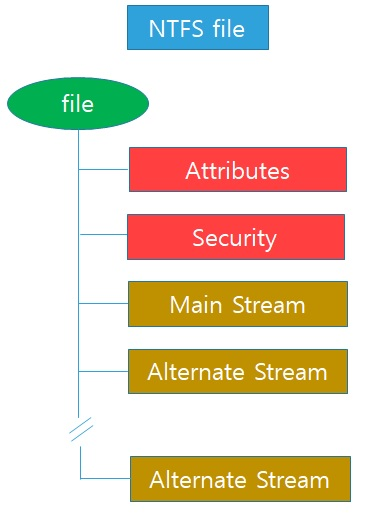
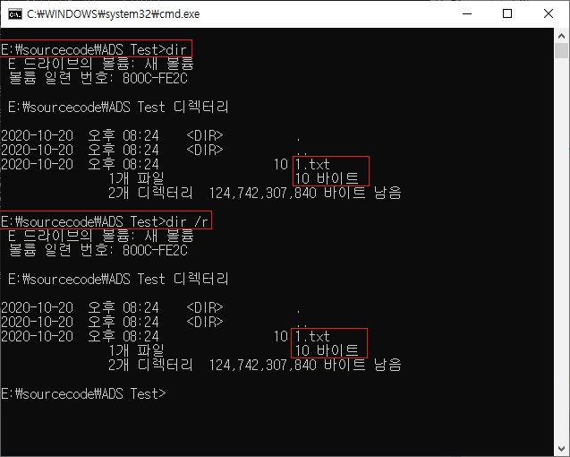
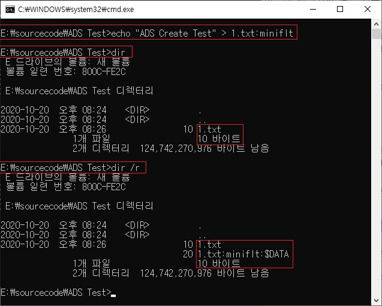
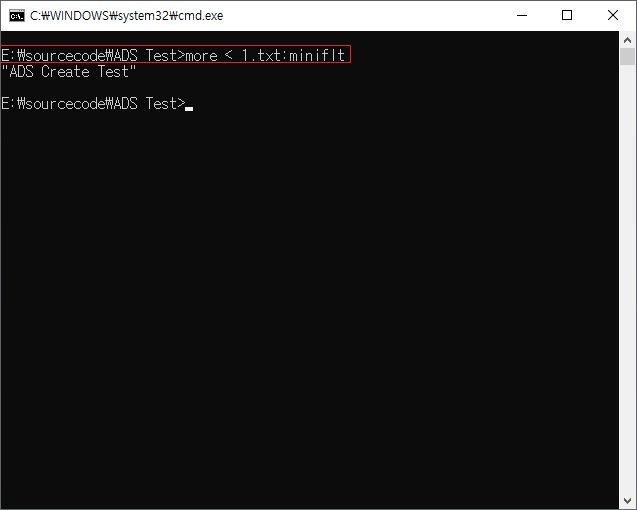

# ADS(Alternate Data Stream)

ADS를 활용하여 기능 개발을 할게 있어서 자료를 조사 하던 중  
내용을 일부 정리하여 작성하였습니다.  



NTFS는 윈도우 NT 계열에서 사용되는 파일시스템 입니다.  
이 NTFS에는 데이터를 숨길 수 있는 ADS 영역이 존재 합니다.  
이 ADS는 NTFS부터 ADS가 윈도우에서 실행 될 수 있도록 제공한 이유는 맥킨토시에서  
사용하는 파일 시스템과 호환성 유지를 위해 ADS 기능을 제공하였습니다.  
맥킨토시에서는 Data 영역과 Resource 영역을 분리하여 사용하는데  
ADS에서도 유사한 형태로 사용 할 수 있도록 만들어졌습니다.  
 
NTFS의 구조를 보면 Main Stream이 존재합니다.  
그리고 Main Stream 외에도 여러 개의 Data Stream이 존재하는 것을   
확인할 수가 있는데 바로 이것이 Alternate Data Stream 입니다.  
 
NTFS 파일 시스템으로 포맷 된 저장 장치의 모든 파일에는 하나 이상의 데이터 스트림이 할당되어 있습니다.   
이를 명명되지 않은 데이터 스트림(Main Stream)이라고 하며   
어떤 파일을 사용자가 두 번 클릭하거나 명령 프롬프트에서 파일을 실행할 때 실행됩니다.  
그리고 NTFS의 기능 중 하나는 파일에 여러 데이터 스트림이 포함 될 수 있습니다.   
이름이 지정되지 않은 기본 데이터 스트림과 구별이 용이하도록   
이름을 지정한 대체 데이터 스트림(ADS)은 추가적으로 메타 데이터를 저장 할 수 있는   
대체 데이터 스트림(ADS)이며 이를 유지하기 위해서는 NFTS를 지원해야 합니다.  
또한 ADS에 데이터를 작성하여도 실제 데이터의 용량은 변화가 없습니다.  
하지만 하드 사용량은 늘어나게 됩니다.  

```
과거에는 이 ADS를 이용하여 악성코드를 실행하기 위해 악의적인 용도로도 사용되었으나  
XP 이후부터는 ADS에서 실행 파일은 실행되지 않도록 막아놨습니다.  
```
  
## ADS 생성 방법  
NTFS 파일 시스템에서는 ADS 영역에 데이터를 작성하여 은닉할 수 있습니다.  
파일을 생성하거나 사용할 때 콜론을 이용하여 쉽게 ADS에 데이터 작성이 가능합니다.  


 
그렇다면 ADS 생성 방법은 아래와 같습니다.  
명령어 : echo "ADS Create Test" > 1.txt:miniflt

  
 
ADS를 생성한 후 먼저 1.txt 파일을 dir 명령어로 조회하면   
기존 데이터나 크기에 대해서는 변화가 없습니다.  
하지만 1.txt 파일을 dir /r 옵션으로 조회하면 1.txt 밑에   
miniflt 데이터 스트림이 생성되어 있음을 확인 할 수 있습니다.  

 

추가적으로 ADS 영역에 저장 된 데이터를 확인 할 땐
간단하게 more 명령으로 저장 된 데이터를 확인 할 수 있습니다. 