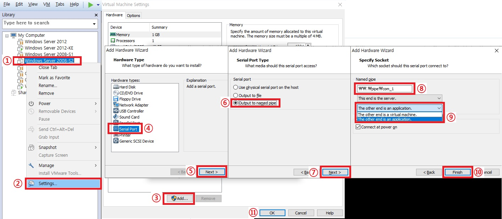
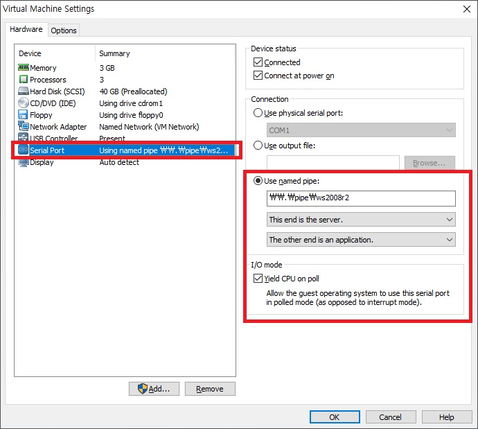
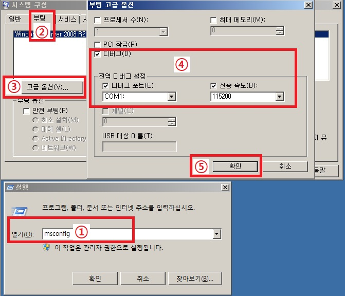
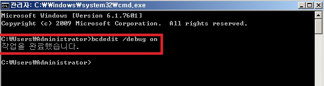
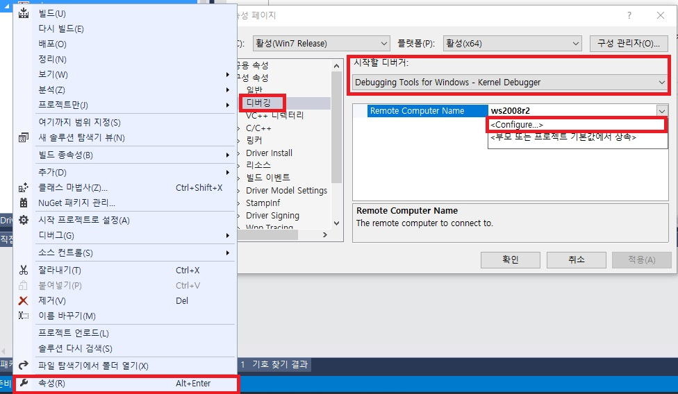
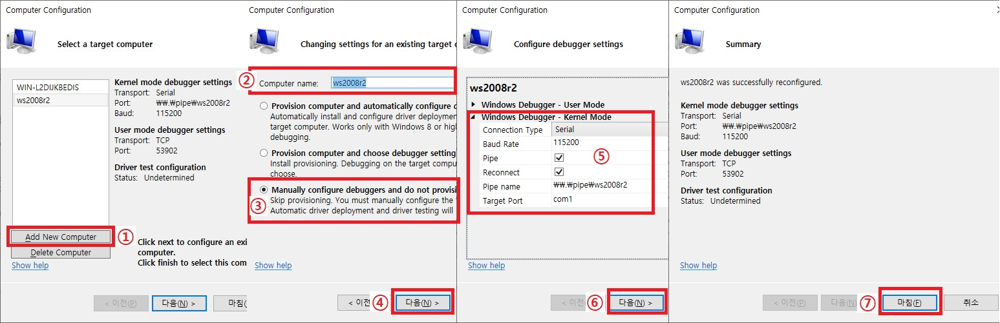
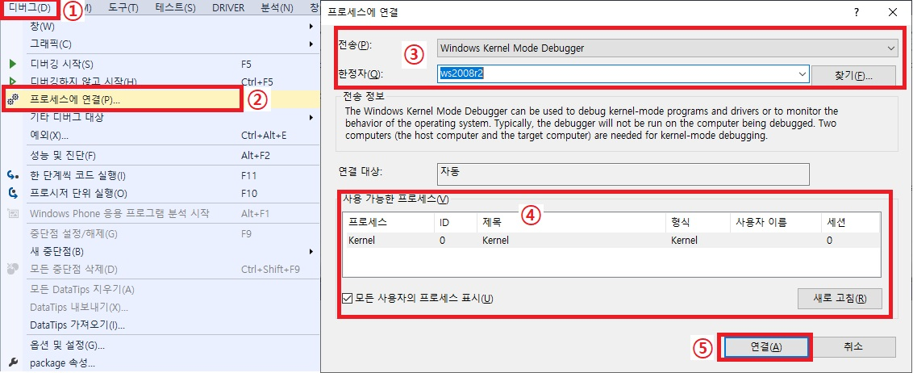
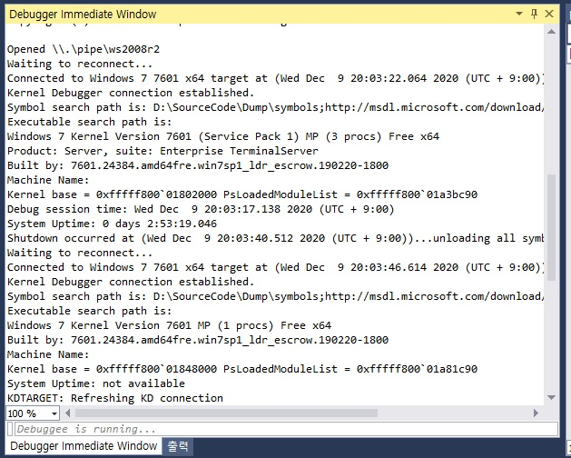

# Visual studio를 이용하여 VMWare에 연동하여 Kernel Debuggin 하는 방법

1. VMWare 설정  
먼저 VMWare를 설정해야 하는데 디버깅을 할 VMWare에 Serial Port를 생성해줘야 합니다.  
순서는 아래 그림과 같습니다.  

  

1. 디버깅 할 VMWare를 종료하고 해당 VMWare를 선택 후 오른쪽 마우스 클릭을 합니다.  
2. Settings.. 클릭  
3. Add 버튼 클릭  
4. Serial Port 선택   
5. Next 클릭  
6. Output ot named pipe 선택  
7. Next 클릭  
8. Named pipe 의 명칭을 입력합니다. ex)\\.\pipe\원하는 명칭 -> \\.\pipe\ws2008r2  
9. The other end is an application 선택  
10. Finish 클릭  

위 순서대로 설정을 하고 나면 아래와 같이 Serial Port가 생성 됩니다.  
그리고 생성된 Serial Port를 클릭하면 오른쪽 밑에 I/O Mode가 있는데  
"Yield CPU on poll" 체크 박스를 클릭해 줍니다.  
(정확히는 모르겠으나 I/O 관련해서 디버깅을 하기 위해서는 선택해야 한다고 합니다.)  

  

그리고 난 뒤 VM을 실행하고 디버깅이 가능하도록 OS 설정을 해줘야 합니다.  

    

1. OS가 부팅이 완료 되면 윈도우키 + r 을 눌러서 실행창을 실행 후 msconfig 실행  
2. 시스템 구성에서 부팅 선택  
3. 고급 옵션 선택  
4. 디버그 체크, 전역 디버그 설정의 디버그 포트 체크 COM1: 선택, 전송 속도 115200 설정  
(여기서 만약 디버그 포트가 COM1이 아닌 경우가 있는데 이 경우는 위에서 Serial Port를 생성하고 나면  
옆에 숫자가 붙으면 그 숫자가 COM숫자 가 됩니다. ex) Serial Port2 -> COM2:  
만약 아무것도 숫자가 안붙어 있으면 COM은 자동으로 1이 됩니다.)  
5. 확인  

  

그 다음에는 바로 Cmd를 실행 후 명령어를 실행해 줘야 합니다.  
1. Cmd 실행  
2. bcdedit /debug on 명령어 실행  
3. reboot  
이러면 VMWare에서의 설정은 끝이 납니다.  

2. Visual Studio 설정  
Visual Studio에서의 설정은 간단합니다.  

  

1. 먼저 Visual Studio를 실행 하고 디버깅 할 제품의 프로젝트를 선택합니다.  
2. 오른쪽 마우스 클릭하여 속성을 선택합니다.  
3. 구성 속성의 디버깅을 선택합니다.  
4. 시작할 디버거를 Debugging Tools for Windows - kernel Debugger 로 선택 합니다.  
5. Remote Computer Name 의 Configure 선택 합니다.  

  

그리고 난 다음에 이제 Serial 통신을 하기 위한 셋팅을 해주면 됩니다.  
1. Add New Computer 클릭  
2. Computer Name 설정 -> 여러개를 설정해야 하는 경우도 있으니 Pipe name과 동일하게 맞춤  
3. Manually Configure debuggers and do not provision 선택  
4. 다음 클릭  
5. Connection Type -> Serial 선택, Baud Rate -> 115200 입력, Pipe 체크, Reconnect 체크, Pipe name 입력, Target Port -> Serial Port  
6. 다음 클릭  
7. 최종적으로 확인 후 마침  

이렇게 설정을 하면 Visual Studio 설정도 끝이 납니다.  

3. Debugging 시작  
이제 VMWare에 연결하여 커널 디버깅을 하도록 하겠습니다.  

  

1. 메뉴 목록에서 디버그 선택  
2. 프로세스에 연결 선택  
3. 전송 -> Windows Kernel Mode Debugger 선택, 한정자 -> VS 설정 시 입력한 Computer Name 선택  
4. 프로세스의 Kernel 선택  
5. 연결  

  

이러면 자동으로 연결이 되면서 코드레벨에서 라이브 디버깅을 적용할 수 있습니다.  
만약 동작을 하지 않을 경우에는 디버깅을 실행한 상태에서  
VMWare를 재부팅 하면 정상적으로 동작을 하게 됩니다.  

