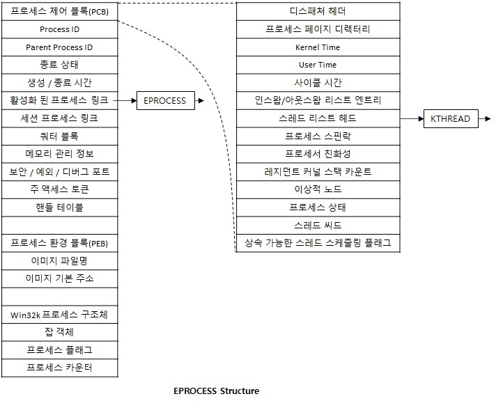

# EPROCESS(Executive Process)

모든 윈도우 프로세스는 EPROCESS(Executive Process) 구조체에 여러가지 속성뿐만 아니라,    
연관된 여러가지 다른 구조체를 가리키는 포인터를 담고 있는 구조체 입니다.    
EPROCESS와 관련된 모든 데이터 구조체는 시스템 주소 공간에 위치 합니다.   
하지만 PEB는 하나의 예외로 프로세스 주소 공간에 위치하는데   
그 이유가 유저 레벨 코드상에서 접근할 필요성이 있기 때문입니다.  
그리고 메모리 관리를 위해 사용되는 프로세스 데이터 구조체 중 일부는   
현재 프로세스 컨텍스트에서만 유효한데, 그 이유는 프로세스 전용 시스템 공간에 저장되기 때문입니다.  
보통 idel process를 제외하고 모든 EPROCESS 구조체는   
Executive Object Manager에 의해 프로세스 객체로 요약 됩니다.  

  

위 그림을 보면 EPROCESS 구조체에 있는 정보들 중 주요 정보 몇가지가 있습니다.  

## 프로세스 제어 블록(PCB)   
PCB(Process Control Block)는 커널 프로세스를 위한 KPROCESS 유형의 구조체 입니다.  
Executive 루틴들은 EPROCESS 내에 정보를 저장하지만, KPROCESS 구조체는 커널 프로세스를 위해서 사용 됩니다.  
여기서 KPROCESS 구조체에 담기는 정보들은 NULL 동기화 객체, 디스패처 객체 헤더,   
프로세스에 속해 있는 스레드 리스트 헤더, 프로세스 우선순위, 가상 메모리 CR3 레지스터 값,   
프로세스 생성, 스레드 기본 실행 시간 값, CPU 종속성 정보 등이 저장 됩니다.  

## 활성화 된 프로세스 링크  
모든 프로세스를 관리하는 데 사용하는 LIST_ENTRY (이걸 잘 다루면 프로세스를 숨길 수 있음)  

## 쿼터 블록  
Winlogon에서 현재 세션에 할당한 Paged, Non-Paged Pool 제한 등과 같은 정보  

## 메모리 관리 정보  
현재 사용할 수 있는 가상 메모리 사이즈와 프로세스 페이지 디렉토리 엔트리 등의 정보  

## 주 액세스 토큰  
프로세스의 보안 프로파일  

## 핸들 테이블  
프로세스의 핸들 테이블  

## 프로세스 환경 블록(PEB)  
유저 모드에서 프로세스의 정보를 담고 있는 구조체  

참고문헌 : Windows Internals
