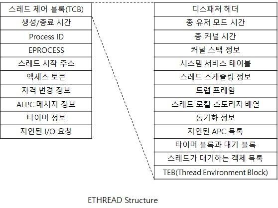

# ETHREAD(Executive Thread)

윈도우 스레드는 ETHREAD(Executive Thread) 객체로 표현 합니다.
ETHREAD 역시 시스템 주소 공간에 위치하고 있으며, ETHREAD 구조체 내 첫번째에 위치한
TCB구조체 내부에 있는 TEB(Thread Environment Block) 구조체만 예외적으로 
프로세스 주소 공간에 위치하고 있습니다. (이것도 PEB와 동일한 이유임)
그리고 ETHREAD는 프로세스에서 실행되고 있는 Thread 갯수만큼 
ETHREAD 구조체를 생성하여 정보를 저장합니다.

  

참고문헌 : Windows Internals