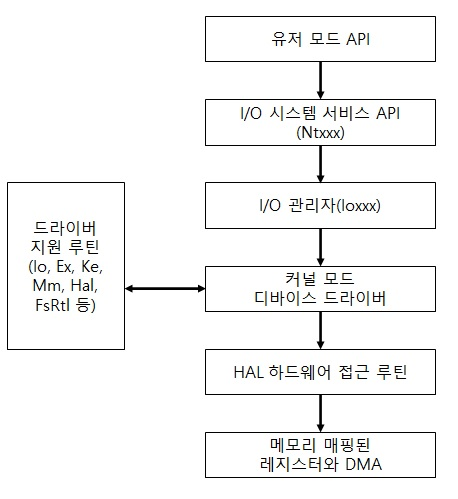

# I/O 매니져   

I/O 매니져는 I/O 요청을 디바이스 드라이버에 전달하는 일관적인 프레임워크나 모델을 정의하기 때문에   
I/O 시스템의 핵심이라 할 수 있습니다. I/O 시스템은 패킷 구동(Packet Driven) 방식 입니다.   
대부분의 I/O 요청은 한 I/O 시스템 구성 요소에서 다른 구성 요소로 전달되는 I/O 요청 패킷(IRP)으로 표현 됩니다.   
그리고 개별 어플리케이션 스레드는 다중 I/O 요청을 동시에 관리하는 것이 관리하며,   
IRP(I/O Request Packet)는 I/O 요청을 완벽하게 설명하는 정보를 담고 있는 데이터 구조체 입니다.   

I/O 매니져는 I/O 작업을 나타내는 IRP를 메모리에 생성하며, IRP의 포인터를 해당 드라이버에 전달하고   
I/O 명령이 완료될 때 해당 IRP를 해제 합니다.   
반면 드라이버는 IRP를 전달받아 IRP가 지정한 작업을 수행한 후 작업을 완료하거나 다른 드라이버가   
추가적인 처리를 할 수 있도록 I/O 매니져에게 다시 전달 합니다.   
I/O 매니져는 IRP 생성과 해제뿐만 아니라 서로 다른 드라이버가 자신만의 I/O 처리를 수행하기 위해   
호출할 공통 코드도 제공합니다.   
일반적으로 I/O 요청은 I/O와 관련된 함수를 실행하는 애플리케이션으로부터 시작되고, I/O 매니져와   
하나 이상의 디바이스 드라이버, HAL에 의해 처리 됩니다.   

그리고 윈도우에서 스레드는 가상 파일을 상대로 I/O를 수행합니다.   
가상 파일은 파일(파일이나 디렉터리, 드라이버, 파이프, 메일 슬롯 등)처럼 취급되는 I/O의 출처나 대상을 일컫습니다.   
OS는 모든 I/O 요청을 가상 파일에서 동작하는 것처럼 추상화합니다.    
왜냐하면 I/O 매니져는 파일 이외의 I/O에 대해서는 전혀 이해를 못하기 때문입니다.   

따라서 파일 지향적인 명령(Open, Close, Read, Write)을 장치 종속적인 명령으로 변환하는것은 드라이버의 책임입니다.   
따라서 이런 추상화는 장치에 대한 애플리케이션의 인터페이스를 일반화 합니다.   
유저 모드 애플리케이션이 문서화 된 함수를 호출하면 파일로부터의 읽기와 파일에 쓰기,   
여타 작업 등을 위해 내부 I/O 시스템 함수가 호출되고, I/O 매니져는 이런 가상 파일의 요청을   
적합한 디바이스 드라이버에 동적으로 전달을 합니다.   

  

참고 문헌 : Windows Internals