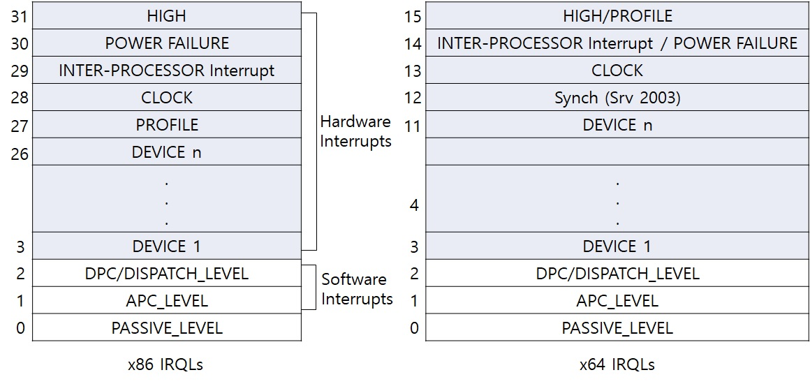

## IRQL(Interrupt Request Levels) 

OS는 스레드가 실행하고 있는 도중에 인터럽트가 발생한다면 이를 처리합니다.    
여기서 스레드에 의한 코드 실행과 인터럽트 발생으로 인한 코드의 실행에는    
각각 해당 중요도가 있으며 OS는 이들 중요도에 근거하여 우선적인 작업을 먼저 처리하게 됩니다.   
  
IRQL은 윈도우 내에서 일어나는 행위(즉 스레드 실행도 하나의 행위이며 인터럽트가 발생하여   
인터럽트 서비스 루틴(ISR)이 실행되는 것도 하나의 행위로 간주됨)에 대한 우선순위 입니다.   
IRQL의 용도는 커널 모드 컴포넌트의 실행에 우선순위를 두기 위함이며, IRQL과 스레드 우선순위를 혼동하면 안됩니다.    
시스템에 존재하는 각 프로세서(CPU)는 자신만의 IRQL을 가지며 x86에서는 (0~31), x64에서는 (0~15)의 IRQL 값을 가지게 됩니다.  

  

만약 시스템에 프로세서 A와 B가 존재하고 프로세서 A의 IRQL은 Clock레벨이고 프로세서 B의 IRQL은 DISPATCH_LEVEL이라고   
가정한다면, OS(시스템) 관점에서 보면 프로세서 A는 매우 우선순위가 높은   
긴박한 작업을 처리하고 프로세서 B는 그나마 덜 중요한 작업을 처리한다고 볼 수 있습니다.    
그렇다면 이런 상황에서는 프로세서 A에서는 Clock 레벨을 포함하여 그 하위 레벨의 IRQL을 가지는 코드는 실행될 수 없고,   
프로세서 B에서는 DISPATCH_LEVEL을 포함하여 그 하위 레벨의 IRQL을 가지는 코드는 실행될 수 없습니다.  

여기서 만약 키보드 인터럽트(Device IRQL)가 발생한다면 키보드 인터럽트를 처리하는 코드는 Device IRQL에서    
실행되므로 프로세서 A에서는 실행될 수 없고 프로세서 B(현재 DISPATCH_LEVEL)를 선점하여 프로세서 B의 IRQL이   
키보드 인터럽트에 해당하는 디바이스 IRQL로 상승된 다음에 키보드 인터럽트를 처리하게 됩니다.    
따라서 이와 같이 낮은 수준의 IRQL에서 실행하는 코드는 높은 수준의 IRQL의 작업이 발생하게 되면 항상 선점됩니다.   

그렇다면 여기서 일반적으로 많이 등장하는 3가지 Software IRQL을 보도록 하겠습니다.   

### PASSIVE_LEVEL  
먼저 PASSIVE_LEVEL은 대부분의 스레드가 실행하는 IRQL입니다.   
즉, IRQL의 관점에서는 유저 모드 스레드 실행은 우선 순위가 가장 낮은 행위로 인식됩니다.   
모든 유저 모드 애플리케이션이 PASSIVE_LEVEL에서 실행하며 디바이스 드라이버의 많은 루틴들도 이 레벨에서 실행합니다.    
따라서 PASSIVE_LEVEL에서는 모든 윈도우 핵심 서비스를 호출할 수 있습니다.    
예를 들어 페이지블(pageable) 메모리를 접근할 수 있고(즉 페이지 폴트를 유발해도 무관함) 파일 I/O가 가능하며 스레드 블록도 가능합니다.    
그리고 커널 드라이버(디바이스 드라이버 포함)를 개발할 때는 항상 DDK 문서를 참조하여   
사용하는 커널 API가 현재 코드의 IRQL에서 사용 가능한지를 반드시 확인해야 합니다.    

### APC_LEVEL  
두번째로 APC_LEVEL은 커널 모드에서 비동기 프로시저 호출(APC-Asynchronous Procedure Call)을 처리할 때   
재 진입을 제어하기 위해 커널 모드 루틴에 의해 사용됩니다.    
APC는 유저 모드 프로그램이나 시스템 코드가 특정 사용자 스레드의 컨텍스트(즉 스레드가 속한 프로세스 주소 공간)에서 실행하기 위한 방식을 제공합니다.    
예를 들어 프로세스 A에서 ReadFile 함수를 비동기적으로 사용하여 파일 읽기를 파일 시스템 드라이버로 요청한다고 할 경우,   
파일 시스템 드라이버는 이 요청을 다시 디스크 드라이버로 보내고 디스크 드라이버는 하드웨어를 제어하여 적절한 위치에서   
파일을 읽어내어 그 값을 파일 시스템 내의 버퍼로 전달하게 됩니다.    
요청된 읽기 작업이 완료된 시점에서 파일 시스템은 읽기 요청을 한 유저 프로세스 A의 유저 주소 공간 내에 존재하는 버퍼로 데이터를 복사해야 합니다.    
하지만 이 작업을 하려면 현재 실행 중인 프로세스가 A인 경우에만 가능합니다.    
만약 디스크 드라이버가 하드웨어로부터 데이터를 읽는 동안 프로세스 A가 컨텍스트 스위칭(Context Switching)되어  
프로세서 B가 현재 프로세스라면 이 작업을 할 수 없게 됩니다.   
따라서 파일 시스템은 APC 메커니즘을 통해 프로세스 A가 현재 프로세스 상태로 되거나 또는 되게 한 이후에   
버퍼 복사 작업을 수행하도록 APC 메커니즘을 사용하여 OS에게 요청합니다.   

### DISPATCH_LEVEL    
세번째로 DISPATCH_LEVEL은 지연된 프로시저 호출(DPC-Deferred Procedure Call)처리와 디스패처(Dispatcher – 윈도우 스케줄러)   
실행 작업을 수행하기 위해 OS에서 사용됩니다.    
DISPATCH_LEVEL에서는 코드가 실행될 때 프로세서는 스레드를 전환하지 않습니다.    
그리고 DISPATCH_LEVEL에서 실행되는 코드는 페이지 폴트를 유발하는 페이지블 메모리를 접근하거나 파일 I/O를 수행해서는 안됩니다.   
그 이유는 DISPATCH_LEVEL에서 페이지 폴트 핸들러가 수행될 수 없기 때문입니다.   
또한 DISPATCH_LEVEL를 포함하여 상위 레벨에서 실행하는 코드는 이미 시그널되지 않은 디스패처 오브젝트를 대기할 수 없습니다.    
왜냐하면 대기하는 이벤트나 뮤텍스를 시그널해 줄 다른 코드가 동작하기 위해서는 윈도우 스케줄러(Dispatcher)가 실행되어야 하는데   
현재 코드가 DISPATCH_LEVEL에서 수행되고 있으므로 이벤트나 뮤텍스를 시그널해줄 코드가 실행될 기회가 없어 선점은 일어나지 않기 때문입니다.   
그리고 DPC(Deferred Procedure Call) 처리 시에는 보통 인터럽트 처리시에 DIRQL에서 수행하지 않아도 되는 작업을 DISPATCH_LEVEL에서   
수행하게 하여 DIRQL 에서의 작업 시간을 줄여서 전체 시스템의 인터럽트 지연시간을 줄일 수 있으며, 타이머와 DPC를 연계하여 사용할 수도 있습니다.   

### DIRQL  
추가적으로 DIRQL(Device IRQL)은 디바이스로부터 발생하는 하드웨어 인터럽트를 사용하기 위해 사용됩니다.   
대부분의 디바이스는 자신만의 정해진 IRQ(인터럽트 컨트롤러에 의해 정의됨) 값을 가지고 있으며,   
이 IRQ 값을 근거로 하여 윈도우는 적절한 DIRQL 값을 결정합니다.    

참고 문헌 : Windows Internals