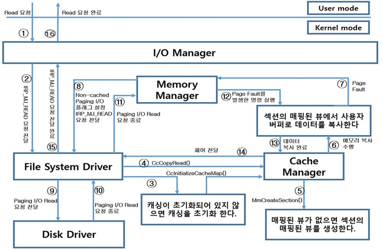

# Read Operation

애플리케이션에서 실제로 파일 읽기를 요청 시도 시 커널에서 어떠한 과정을 거치면서  
디스크에 있는 데이터가 캐시로 복사되어 애플리케이션에 전달되는지의 과정을 정리하려고 합니다.

  

1. 애플리케이션이 데이터 읽기 요청을 한다.  
1. I/O 매니져는 데이터 읽기 동작에 대한 IRP 생성 후 파일 시스템 드라이버(File System Driver)에 전달 한다.  
1. FSD는 오픈 된 파일에 직접 데이터 읽기 동작 지시한다. 이때 파일이 캐싱 되지 않았다면 캐시 매니져를 호출하여 초기화 및 파일 매핑을 생성 한다.  
1. FSD는 데이터 읽기를 캐시 매니져에게 요청 한다.  
1. 캐시 매니져는 파일의 데이터 구조 검사 및 매핑 된 뷰를 검사 및 생성 한다.  
1. 캐시 매니져는 매핑 된 뷰에 사용자 버퍼로 메모리 복사를 수행 한다.  
1. 파일의 매핑 된 뷰가 실제 요구된 데이터를 포함하는 물리 페이지와 연결되어 있지 않으면 페이지 폴트를 발생 및 해결을 위한 메모리 매니져를 호출 한다.  
1. 메모리 매니져는 물리 페이지를 할당하고 I/O 매니져를 통해 FSD에 물리 디스크에서 데이터를 읽기 위한 I/O(Non-cached Paging I/O Read) 요청 한다.  
1. Non-cached 데이터 읽기 요청을 받은 FSD는 데이터를 얻기 위한 I/O 요청을 생성 및 디스크 드라이버에 요청 한다.  
1. 디스크 드라이버가 데이터를 얻고 I/O 요청을 종료 한다.  
1. FSD는 메모리 매니져가 요구한 Paging I/O 요청을 종료 한다.   
1. 페이지 폴트를 발생시켰던 명령을 다시 실행 한다.  
1. 캐시 매니져는 파일의 매핑 된 뷰에서 사용자 버퍼로 데이터를 복사 한다.  
1. 캐시 매니져는 캐시 된 데이터를 사용자 버퍼로 복사한 후 제어를 FSD에 전달한다.    
1. FSD는 I/O 매니져가 처음에 전달한 IRP에 대한 처리를 종료한다.    
1. I/O 매니져가 데이터 읽기 요청을 완료한다.    

참고 문헌 : Windows 구조와 원리