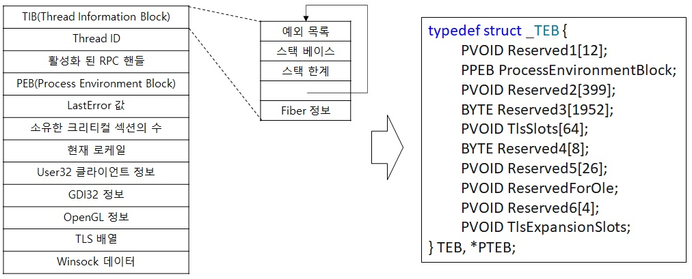

# TEB(Thread Environment Block)

TEB는 프로세스에서 실행되는 Thread에 대한 정보를 담고 있는 프로세스 주소 공간에 위치하는 구조체 중 하나 입니다.   
TEB역시 각각의 Thread 당 하나씩 TEB 구조체가 생성되어 이미지 로더와   
다양한 윈도우 DLL들에 대한 컨텍스트 정보를 담고 있습니다.  
그리고 이 정보들은 유저 레벨에서 실행되기 때문에 유저 레벨에서 쓰기가 가능한 구조체가   
필요하기 때문에 시스템 주소 공간이 아닌 프로세스 주소 공간에 위치합니다.  

  

TEB 구조체 역시 OS가 출시 될 때마다 거의 변경되고.. MSDN에도 변경될 수 있다고 써놨네요..  
그렇지만 여기서 중요하게 봐야 할 2가지가 있는데 바로 TIB와 PEB입니다.  

## TIB(Thread Information Block)
TEB는 내부적으로 TIB(Thread Information Block)라는 헤더로 구성돼 있는데   
이것은 OS/2와 Win9x 애플리케이션의 호환성을 위해 존재합니다.  
또한 초기 TIB를 이용해 새로운 스레드를 생성할 때 예외와 스택 정보가 더 작은 구조체로 유지되게 해줍니다.  
그리고 TIB내에 SEH(Structured Exception Handler) 체인 중 최상위 엔트리를 말합니다.  

## PEB(Process Environment Block)
PEB는 유저 모드에서 프로세스의 정보를 담고 있는 구조체로 유저 모드에서 접근할 필요가 있는     
이미지 로더와 힙 관리자, 다른 윈도우 컴포넌트들이 필요로 하는 정보를 포함하고 있습니다.   

참고 문헌 : Windows Internals 및 MSDN