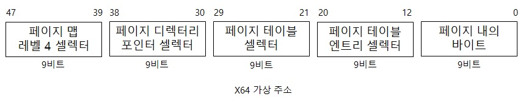
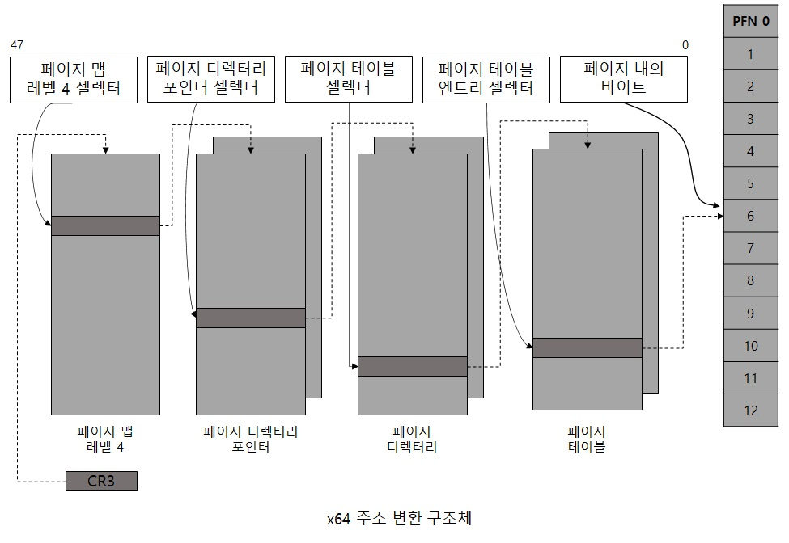
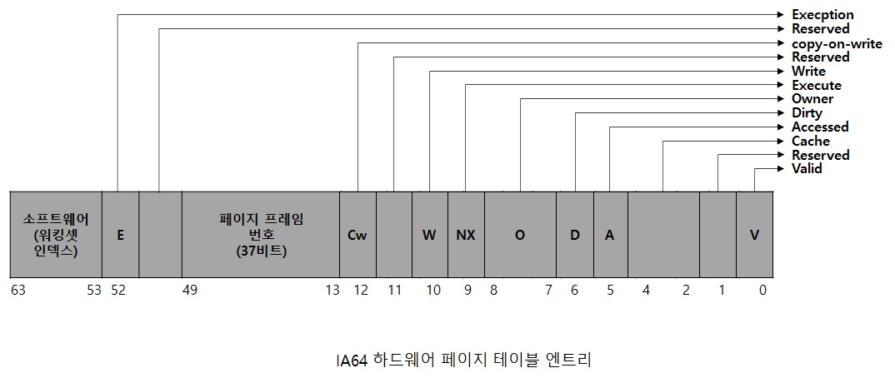

# x64 가상 주소 변환

현재 x64에서는 가상 주소는 48비트 입니다.  
그리고 x64에서의 가상 주소 변환은 x86의 PAE와 비슷하지만 4번째 단계가 추가되었습니다.  
각 프로세스는 페이지 맵 레벨 4 테이블로 불리는 확장된 최상위 레벨의 페이지 디렉터리를 갖는데,  
이것은 페이지 페어런트 디렉터리라고 불리는 레벨 3 구조체에 대한 512개의 물리 위치를 포함하고 있습니다.  
x86 PAE의 페이지 디렉터리 포인터 테이블(PDPT)에서는 프로세스당 1개 였지만  
페이지 페어런트 디렉터리에서는 512개가 있고, 각 페이지 페어런트 디렉터리도 4개가 아닌   
512개의 엔트리를 포함하는 완전한 페이지 입니다.  
페이지 디렉터리 포인터 테이블(PDPT) 처럼 페이지 페어런트 디렉터리 엔트리는   
레벨 2 페이지 디렉터리에 대한 물리 주소를 포함하고, 각 페이지 디렉터리는 512개의   
페이지 테이블 위치를 가리키는 포인터를 포함하고 있습니다.  
그리고 마지막으로 페이지 테이블은 메모리 상의 페이지 물리 위치를 가리킵니다.  

## IA64 가상 주소 변환

IA64 용 가상 주소 공간은 하드웨어에 의해 8개 영역으로 나눠지며,   
각 영역은 각자의 페이지 테이블 셋트를 가질 수 있습니다.  
윈도우는 이 중 5개 영역만 사용하며, 그 중에서 3개만 페이지 테이블을 갖습니다.  
아래 표는 해당 영역들에 대한 용도로 사용되는지 확인하실 수 있습니다.  

## IA64 영역

|  
영역
 |  
용도
 | 
|:--------:|:--------:|
|**
0
** | *
사용자 코드와 데이터
* |
|**
1
** | *
세션 공간 코드와 데이터
* |
|**
2
** |*
사용되지 않음
* |
|**
3
** | *
사용되지 않음
* |
|**
4
** |*물리 메모리와 1:1 매핑이 캐시된 Kseg3 영역입니다.\\메모리 매니져에 의해 필요한 TLB에 대한삽입이 직접 이뤄지므로 이 영역에 대해서는 페이지 테이블이 필요 없습니다.* |
|**
5
** |*물리 메모리와 1:1 매핑이 캐시되지 않은 Kseg4 영역입니다.\\이 영역은 I/O 포트 범위 같은I/O 위치에 접근을 위한 몇개의 공간만을 위해 사용됩니다. 이 영역에 대해서는 페이지 테이블이 필요 없습니다.* |
|**
6
** |*
사용되지 않음
* |
|**
7
** |*
커널 코드와 데이터
* |

IA64에서 동작하는 64bit 윈도우의 가상 주소 변환은 3개의 페이지 테이블을 갖는데,  
각 프로세스는 페이지 디렉터리에 대한 1,024개의 포인터를 저장하고 있는  
페이지 디렉터리 포인터 구조체를 갖습니다.  
그리고 각 페이지 디렉터리는 1,024개의 페이지 테이블 포인터를 가지고,  
페이지 테이블은 물리 페이지를 가리킵니다.  

