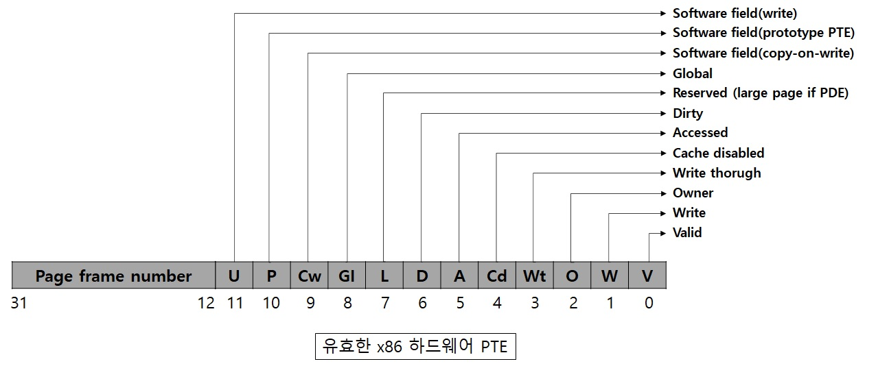

# x86 가상 주소 변환 (2)

## 페이지 디렉터리  
- non-PAE x86 시스템에서 각 프로세스는 페이지 디렉터리를 하나씩 가지며,   
메모리 매니져가 해당 프로세스의 모든 페이지 테이블에 대한 위치를 매핑하기 위해 생성된 정보를 저장합니다.   
- 페이지 디렉터리의 물리 주소는 해당 프로세스의 커널 프로세스 구조체(KPROCESS) 내 저장되어 있으며,   
non-PAE 시스템에서는 가상 주소 0xC0300000에 매핑되어 있습니다.  
- CPU는 CR3 레지스터로부터 페이지 디렉터리 위치를 획득하며, 페이지 디렉터리의 페이지 프레임 번호를 포함하고 있습니다.  
- 페이지 디렉터리는 항상 페이지 정렬이 되어 있어서, 주소의 하위 12비트는 항상 0 입니다.  
- 페이지 디렉터리는 프로세스의 가능한 모든 페이지 테이블에 대한 위치와,  
상태 정보가 저장되어 있는 4바이트 길의 페이지 디렉터리 엔트리(PDE)로 구성되어 있습니다.  
- 4GB의 전체 가상 주소 공간을 표현하려면 1,024개의 페이지 테이블이 필요하며,   
페이지 테이블을 매핑하기 위해 페이지 디렉터리는 1,024개의 PDE가 존재 합니다.  
- 페이지 디렉터리 인덱스는 10비트(2에 10승 = 1,024) 길이를 가져야 합니다.  
- 윈도우에서 프로세스는 각각의 전용 주소 공간을 가지고 있기 때문에   
자신의 전용 주소 공간을 매핑하는 페이지 테이블과 페이지 디렉터리를 가지게 됩니다.  
- 시스템 공간을 위한 페이지 테이블은 모든 프로세스가 공유하며, 세션 공간은 같은 세션 내에 포함 된 프로세스들끼리만 공유합니다.  
- 동일한 가상 메모리를 가리키는 여러개의 페이지 테이블을 갖지 않기 위해,  
프로세스가 생성 될 때 시스템 공간을 가리키는 페이지 디렉터리 엔트리는 기존에 존재하는 시스템 페이지 테이블을 가리키게 초기화 합니다.  
- 동일한 프로세스 내의 스레드들은 하나의 프로세스 주소 공간을 공유해 동일한 페이지 디렉터리와 페이지 테이블을 사용하기 때문에   
같은 프로세스 내의 스레드로 컨텍스트 스위칭이 일어날 경우 페이지 디렉터리에 대한 물리주소가 다시 로딩되지 않습니다.  

  
 
## 페이지 테이블과 페이지 테이블 엔트리  
- 각 페이지 디렉터리 엔트리는 페이지 테이블을 가리키며, 페이지 테이블은 PTE의 배열로 구성되어 있습니다.  
- 가상 주소의 페이지 테이블 인덱스 필드는 찾으려는 페이지와 매핑된 PTE가 어느 페이지 테이블 내에 위치하는지를 가리킵니다.  
- 페이지 테이블 인덱스는 10비트 크기를 가지며, 4바이트 PTE 1,024개를 참조 할 수 있습니다.  
- x86시스템에서 각 페이지 테이블은 4MB의 데이터 페이지를 매핑 할 수 있습니다.  
- 4GB의 가상 주소 공간 전체를 매핑하기 위해서 필요한 페이지 테이블 개수는 1,024(4GB/4MB)개의 페이지 테이블이 필요합니다.  
 
## PTE 상태와 보호 비트
|  
비트 이름
 |  
의미
 | 
|:--------:|:--------:|
|**
Accessed
** | *
페이지가 읽혀졌다.
* |
|**
Cache Disabled
** | *
 페이지에 대한 CPU 캐싱을 비활성화한다.
* |
|**
Copy-on-write
** |*
이 페이지에 대한 Copy-on-write가 사용된다.
* |
|**
더티(Dirty)
** | *
페이지에 기록이 일어 났다.
* |
|**
전역(Global)
** |*
주소 변환이 모든 프로세스들에 영향을 준다.(예를 들어 변환 버퍼의 플러시는 이 PTE에 영향을 주지 않는다.)
* |
|**
Large Page
** |*
PDE가 4MB(PAE 시스템에서는 2MB)짜리 페이지에 매핑됨을 표시한다.
* |
|**
Owner
** |*
유저 모드 코드가 이 페이지에 접근 가능한지, 커널 모드 전용인지를 표시 한다.
* |
|**
Prototype
** |*
PTE가 섹션 객체와 연관된 공유 메모리의 템플릿으로 사용되는 프로토타입 PTE임을 표시한다.
* |
|**
유효(Valid)
** |*
주소 변환이 물리 메모리 내의 페이지로 매핑되는지 나타낸다.
* |
|**
Write through
** |*
이 페이지를 write-through(프로세서가 페이지 속성 테이블을 지원한다면)나 write-combined로 표시한다.
이것은 보통 비디오 프레임 버퍼 메모리를 매핑할 때 사용한다.
* |
|**
쓰기(Write)
** |*
페이지가 쓰기 가능한지 메모리 관리 유닛(MMU)에게 알려준다.
* |

 
x86 시스템에서 하드웨어 PTE는 메모리 관리 유닛(MMU)에 의해   
변경될 수 있는 더티 비트와 Accessed 비트 두 개를 포함합니다.  
액세스 하는 시점에 Accessed 비트가 꺼져 있다면 페이지에 대해 읽기나 쓰기가 일어날 때   
MMU는 Accessed 비트를 설정하며, 페이지에 쓰기가 일어날 때마다 더티(Dirty) 비트를 설정합니다.  
그리고 MMU는 위 2개의 비트를 절대로 끄지 않으며, OS가 적절한 시점에 끄게 됩니다.  

참고 문헌 : Windows Internals