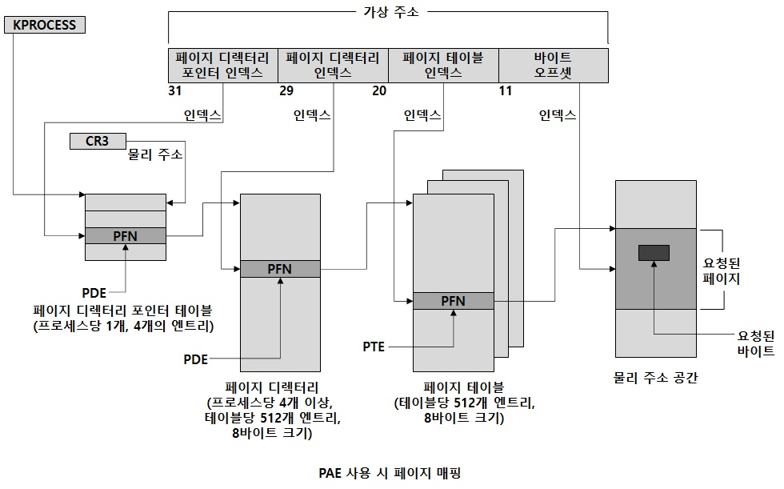

# x86 가상 주소 변환 (3)

앞전에서는 Non-PAE에 대해서 설명하였는데, 이번에는 물리 주소 확장(PAE)에 대해서 기록해보도록 하겠습니다.  
먼저 물리 주소 확장(Physical Address Extension)이라는 메모리 매핑 모드가   
인텔 x86 펜티엄 프로에서 처음 소개 되었습니다.  
현재 x86 프로세서를 사용하는 32bit OS에서 64GB의 물리 메모리까지 접근할 수 있게 해줍니다.  
아래 그림을 보면 프로세서가 PAE 모드로 동작중 일 때   
메모리 관리 유닛(MMU)는 가상 주소를 4개의 필드로 나눕니다.  
MMU는 페이지 디렉터리와 페이지 테이블을 사용하지 않지만 PAE 모드에서는   
페이지 디렉터리 포인터 테이블이라는 3단계가 그 위에 하나 더 존재합니다.  

32bit 애플리케이션에서 이런 큰 메모리 구성 시 이점을 가질 수 있는 한가지 방법은 '주소 윈도우 확장' 인데  
애플리케이션에서는 이런 기능을 사용하지 않더라도 메모리 매니져는   
멀티프로세스 시스템 캐시, 스탠바이 리스트, 변경된 리스트를 통해 가능한 모든 물리 메모리를 사용해서   
여러 프로세스의 워킹셋과 파일 캐시, 전용 데이터를 지원합니다.  

그럼 여기서 PAE의 목적은 4GB 이상의 RAM을 가리킬 수 있게 하는것입니다.  
따라서 PAE에서 PFN은 24비트로 확장됩니다. (기존 Non-PAE 에서 PFN은 20비트)  
그리고 12비트 오프셋과 결합해서 2에 24승 + 12바이트나 64GB의 메모리를 가리킬 수 있게 됩니다.  
24비트 PFN을 제공하기 위해 PAE는 페이지 테이블 엔트리와 페이지 디렉터리 엔트리의 PFN 필드를 20비트에서  
24비트로 확장을 하는데 이 확장을 위한 공간 확보를 위해 페이지 테이블 엔트리와   
페이지 디렉터리 엔트리는4바이트 대신 8바이트를 사용하게 됩니다.  
그리고 페이지 테이블과 페이지 디렉터리는 한 페이지에 맞아야 하기 때문에 이 테이블들은   
1,024개의 엔트리 대신 512개의 엔트리만 가질 수 있습니다.  

따라서 가상 주소와 연관된 인덱스 필드는 그에 맞게 10비트에서 9비트로 줄어들게 됩니다.  
그리고 가상 주소에서 고려되지 않은 2개의 최상위 비트가 남게 됩니다.  
따라서 PAE는 페이지 디렉터리 수를 1개에서 4개로 확장하고 페이지 디렉터리 포인터 테이블(PDPT)이라는  
3번째 단계의 주소 변환 테이블을 추가합니다.  
이 페이지 디렉터리 포인터 테이블은 4개의 페이지 디렉터리에 대한 PFN을 제공하는   
8바이트 길이의 4개 엔트리만 갖고 가상 주소의 최상위 2비트는 페이지 디렉토리 포인터 테이블에 대한  
인덱스로 사용되며, 페이지 디렉터리 포인터 인덱스라고 합니다.  
그리고 기존 CR3 레지스터는 최상위 테이블의 위치를 제공하는데 PAE에서는 페이지 디렉터리 포인터 테이블을 가리킵니다.  

참고 문헌 : Windows Internals