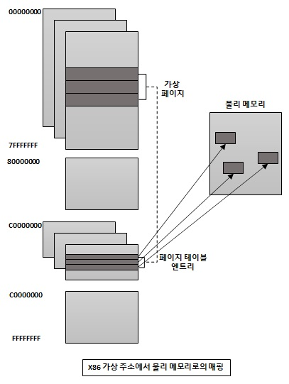
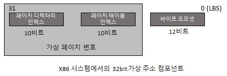
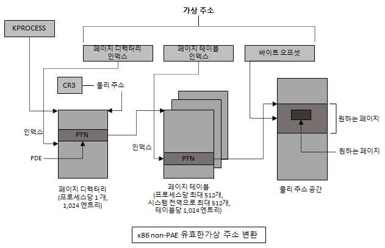

# x86 가상 주소 변환

유저 모드에서 동작하는 애플리케이션과 시스템 코드는 가상 주소 공간을 참조합니다.  
메모리 매니져는 페이지 테이블을 생성하고 관리하는데 이 생성된 페이지 테이블을 이용해서  
CPU는 가상 주소를 물리 주소로 변환을 합니다.  
각각의 가상 주소는 시스템 영역 구조체인 PTE(Page Table Entry)와 연계되어 있는데   
가상 주소와 매핑된 물리 메모리 주소가 여기에 저장되어 있습니다.  
하지만 페이지 테이블은 첫 번째 페이지 폴트가 발생할 때에만 할당되기 때문에  
실제 접근이 일어나지 않는다면 아무리 예약되었거나 커밋된 영역이라도 PTE가 존재하지 않을 수도 있습니다.  

<p align="center">

</p>  

그렇다면 여기서 x86에서의 윈도우는 가상 주소 변환을 위해 PAE(Physical Address Extension)와 non-PAE 두가지 방법을 사용합니다.  
먼저 non-PAE x86 시스템은 가상 주소를 물리 주소로 변환하기 위해 2단계로 구성된 페이지 테이블 구조체를 사용합니다.  
4KB의 페이지에 의해 매핑된 32bit 가상 주소는 ```가상 페이지 번호```와 ```바이트 오프셋```이라는 페이지 내 2개의 필드로 표현합니다.  
그리고 다시 가상 페이지 번호는 ```페이지 디렉터리 인덱스```와 ```페이지 테이블 인덱스```라는 두개의 하위 필드로 나뉘어 집니다.  
여기서 ```페이지 디렉터리 인덱스```와 ```페이지 테이블 인덱스```는 ```페이지 디렉터리```와 ```페이지 테이블 내의 엔트리 위치```를 나타내는 데 사용됩니다.  
그리고 페이지 디렉터리 인덱스와 페이지 테이블 인덱스의 크기는 자신들이 참조하는 구조체에 의해 결정됩니다.  
예를 들어 페이지는 4096(2에 12승 = 4K)바이트 이므로 페이지 내의 바이트를 나타타내는 바이트 인덱스는 12비트 입니다.  
그리고 페이지 디렉터리 인덱스와 페이지 테이블 인덱스는 자신들이 가리키는 구조체가 1024(2에 10승)개의 엔트리를 가지므로 10비트 입니다.  

<p align="center">

</p>  

가상 주소의 바이트 오프셋 값은 물리 주소 것과 동일합니다.  
따라서 주소 변환은 가상 페이지 번호를 물리 페이지 번호(PFN)로 변환하는 것이라고 할 수 있습니다.   
바이트 오프셋은 주소 변환에 참여하지 않고, 주소 변환의 결과로도 변경되지 않으며,   
단순히 가상 주소에서 물리 주소로 복사 됩니다.  
그렇다면 페이지 디렉터리 인덱스 , 페이지 테이블 인덱스, 바이트 오프셋 값 간의   
관계와 주소 변환을 수행하는 과정을 그림으로 표현하면 아래와 같습니다.  

<p align="center">

</p>  

가상 주소 변환 과정
1. 메모리 관리 유닛(Memory Management Unit)은 물리 주소의 페이지 디렉터리를 얻기 위해 CPU 레지스터 CR3를 사용합니다.  
1. 가상 주소의 ```페이지 디렉터리 인덱스``` 영역은 ```페이지 디렉터리 내의 인덱스```인데   
가상 주소를 매핑하는데 필요한 페이지 테이블의 위치를 포함하는 페이지 디렉터리 엔트리(PDE)를 가리킵니다.   
PDE는 페이지 테이블에 대한 페이지 프레임 번호(PFN)라는 물리 페이지 번호를 포함합니다.  
1. 페이지 테이블 인덱스는 페이지 테이블 내의 인덱스로, 현재 찾으려는 가상 주소와 연관된 PTE가 위치합니다.  
1. PTE의 유효 비트가 0이면 페이지 폴트를 발생시킵니다.   
OS의 메모리 관리 폴트 핸들러는 페이지를 위치시키고 유효하게 만듭니다.  
만약 페이지를 유효하게 만들지 못하거나 해서는 안된다면 폴트 핸들러는 에러를 발생시킵니다.  
1. PTE가 유효한 페이지를 가리킬 때 요청된 물리 주소는 PTE의 PFN 필드로부터   
윈본 가상 주소의 바이트 오프셋 이후만큼 후에서 주소를 얻습니다.  

참고 문헌 : Windows Internals