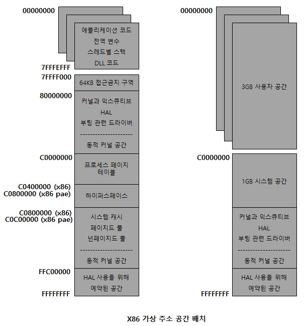

# x86 주소 공간 배치

x86 윈도우에서 동작하는 프로세스들은 최대 4GB의 가상 메모리 용량을 사용합니다.  
여기서 애플리케이션이 참조할 수 있는 2GB의 전용 주소 공간을 갖고   
나머지 2GB는 모든 프로세스들이 공유하는 영역으로 OS가 가지고 있습니다.  
하지만 increaseuserva BCD 부팅 옵션을 사용하면 애플리케이션이   
참조할 수 있는 주소 공간은 3GB까지 가질 수 있게 됩니다.  
하지만 애플리케이션이 3GB를 사용하는 만큼 OS가   
사용할 수 있는 가상 메모리 공간은 1GB로 줄어들게 됩니다.  

그렇게 되면 OS가 사용할 수 있는 가상 메모리 공간에서는 넌페이지드 풀, 특수 풀, 페이지드 풀,   
PTE(System Page Table Entry), 시스템 맵 뷰, 파일 시스템 캐시, 파일 시스템 구조체(metadata), 세션 공간  
이런 것들이 시스템 주소 공간에 할당 되는데 특히 디스크의 크기가 커질수록 캐시 매니져가 사용할 수 있는  
주소 공간의 크기가 제한되기 때문에 OS가 운영하는데 있어서 제약 사항이 될 수 있습니다.  
그리고 PTE(System Page Table Entry)는 IO 공간, 커널 스택, 메모리 디스크립터 리스트 매핑같이 시스템 페이지들을  
동적으로 매핑하는 데 사용하는데, 이 PTE는 무제한적인 리소스가 아닌 x86 기준으로 2GB의   
연속적인 시스템 가상 주소 공간을 이론적으로 나타 낼 수 있을 만큼입니다.  

  

거기다가 세션 공간 역시 다중 세션을 가진 시스템을 위해 세션별로 고유한 코드와 데이터들이 시스템 주소 공간에  
매핑되어서 해당 세션 내의 프로세스들끼리 공유를 하며, 세션 공간 컴포넌트들의 크기는 커널의 다른 시스템 주소 공간과  
마찬가지로 요청 시 메모리 매니져에 의해 동적으로 구성되고 크기가 재조정 됩니다.  

참고 문헌 : Windows Internals
