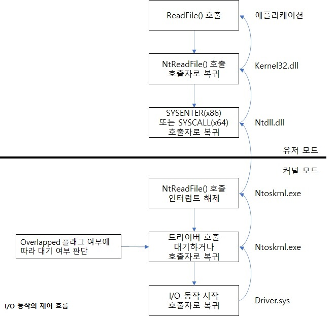

# 동기(Synchronize)적 I/O와 비동기(Asynchronize)적 I/O  

보통 어플리케이션에서 사용되는 I/O는 동기적 I/O 입니다. 그래서 보통 애플리케이션 스레드내에서   
Read 또는 Write 요청 시 I/O 요청이 완료돼 상태 코드를 반환할 때까지 대기를 합니다.   
이 후 프로세스는 요청한 작업의 데이터에 즉시 접근이 가능하게 됩니다.    
I/O 요청이 가장 단순한 형태로 사용 될 때에는 ReadFile과 WriteFile 함수를 동기적으로 사용하며   
이 함수들은 호출자에게 제어를 반환하기 전에 I/O 요청 작업을 완료 합니다.  
  
반대로 비동기 I/O는 애플리케이션이 다수의 I/O 요청을 발생하고 I/O 작업을 수행하는 동안에도   
다른 작업을 할 수 있게 해줍니다. 이렇게 되면 I/O가 수행되는 동안에도 애플리케이션 스레드가   
다른 작업을 할 수 있어서 처리량을 향상 시킬 수 있습니다.  
비동기 I/O를 설정하려면 CreateFile 호출 시 FILE_FLAG_OVERLAPPED 플래그를 실정해야 합니다.  
그리고 비동기 I/O를 요청 할 때에는 I/O 동작에 관련된 어떤 데이터라도 접근하지 않게 주의 해야 하며   
스레드는 I/O가 완료 될 때 시그널 되는 동기화 객체의 핸들을 감시해 I/O 요청이 완료되는것과   
스레드의 실행을 동기화 시켜야 합니다.  
  
여기서 애플리케이션이 요청한 I/O 동작이 드라이버로 전달되면 I/O 명령은 내부적으로 I/O 요청의   
유형과 관계없이 비동기적으로 수행됩니다.  
즉 I/O 요청이 시작되면 드라이버는 I/O 시스템으로 복귀하게 되며 I/O 시스템이 즉시 호출자에게   
복귀 할지는 CreateFile 수행 시 설정 된 동기/비동기 옵션에 따라 결정됩니다.   

  
참고 문헌 : Windows Internals