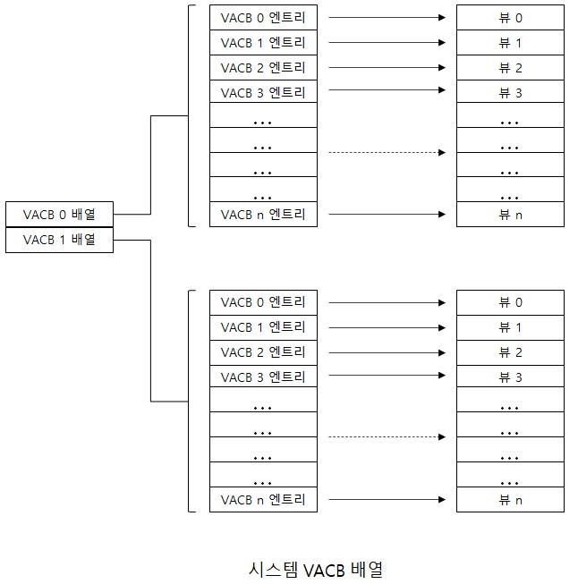
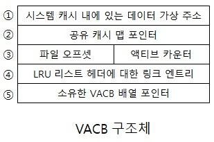

# 시스템 전역 캐시 데이터 구조

캐시 매니져는 캐시된 파일들을 추적 관리하기 위한 데이터 구조체는 다음과 같습니다.  
- 시스템 캐시에 있는 256KB 단위 슬롯은 가상 주소 제어 블록(Virtyal Address Control Block)에 의해 기술된다.  

- 각기 별도로 열린 캐시된 파일은 전용 캐시 맵(Private Cache Map)을 가지고 있으며,  
이 전용 캐시맵은 미리 읽기를 제어하는 데 사용되는 정보가 보관 된다.  

- 캐시된 각 파일은 하나의 공유 캐시 맵(Shared Cache Map) 구조체를 가지고 있는데,  
해당 파일의 매핑된 뷰들을 보관하는 시스템 캐시의 슬롯들을 가리킨다.  

캐시 매니져는 가상 주소 제어 블록(VACB)이라는 넨페이지드 풀에 저장되는 데이터 구조체의   
배열을 이용해 시스템 캐시에 있는 뷰들의 상태를 추적 관리 합니다.  

## 가상 주소 제어 블록 VACB  
|  

 |  
32bit
 |  
64bit
 | 
|:--------:|:--------:|:--------:|
|**
크기
** |*
32byte
* |*
64byte
* |
|**
VACB 배열
** |*
4,096
* |*
2,048
* |

  

각 VACB 배열은 낮은 우선순위 매핑 VACB와 높은 우선 순위 매핑 VACB로 구성됩니다.  
먼저 시스템은 각 VACB 배열에 최초 64개의 높은 우선 순위 VACB를 할당합니다.  
높은 우선순위의 VACB는 시스템 주소 공간에서 미리 할당된 자신만의 뷰를 가집니다.  
그리고 메모리 매니져가 데이터를 매핑하려 할 때 캐시 매니져에게 전달할 뷰가 없고,  
매핑 요청이 높은 우선순위로 표시가 되어 있다면 캐시 매니져는 높은 우선순위 VACB에  
미리 할당된 뷰 중에 하나를 사용하게 됩니다.  

일반적으로 매핑의 우선순위는 낮게 기본 설정되어 있습니다.  
하지만 캐시된 자료를 고정할 때 PIN_HIGH_PRIORITY 플래그를 사용함으로써  
높은 우선순위 VACB가 대신 사용되게 요청할 수 있습니다.  

  

|  
필드
 |  
설명
 | 
|:--------:|:--------:|
|**
①
** |*
시스템 캐시 내에 있는 데이터에 대한 가상 주소
* |
|**
②
** |*
어떤 파일이 캐시되었는지 구분하기 위한 고유 캐시맵 구조체를 가리키는 포인터
* |
|**
③
** |*
뷰가 시작되는 파일 내의 오프셋을 나타내며(항상 256KB 단위), 하위 16비트는 항상 0 임, 이 비트(액티브 카운트)는 뷰에 대한 참조 수를 저장하기 위해 재사용 됨
* |
|**
④
** |*
캐시 매니져가 VACB를 해제 할 때 VACB를 LRU VACB의 리스트에 연결하는 용도로 사용함  캐시 매니져는 새로운 VACB를 할당 할 때 먼저 이 리스트를 검사함
* |
|**
⑤
** |*
VACB를 VACB가 저장되는 배열을 나타내는 VACB 배열 헤더에 연결하는 용도로 사용함
* |

파일 I/O 동작 동안에 파일의 VACB 참조 카운트는 증가하고 I/O 동작이 종료할 때 감소합니다.  
따라서 참조 카운트가 0이 아니라면 VACB는 액티브 상태 이며, 파일 시스템 메타데이터에 접근하는 경우  
액티브 카운트는 얼마나 많은 파일 시스템 드라이버가 메모리에 락 되어 있는   
해당 뷰에 대한 페이지를 갖고 있는지 나타 냅니다.  

참고 문헌 : Windows Internals
