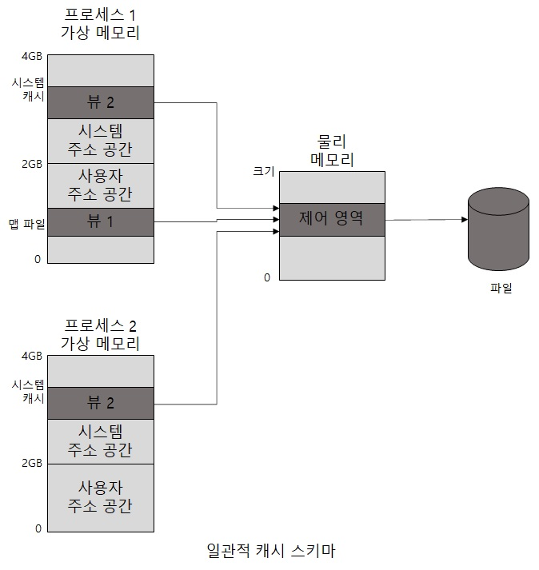

# 캐시 일관성 

실제 물리 메모리에 얼마나 많은 캐시 데이터가 존재하는지 캐시 매니져는 알지 못합니다.   
왜냐하면 캐시 매니져는 표준 섹션 객체(파일 매핑 객체)를 이용해 파일 뷰들을   
시스템의 가상 주소 공간에 매핑시키는 방법으로 데이터에 접근하고 있기 때문입니다.   
그대신 캐시 매니져는 캐시 데이터에 접근하는 모든 프로세스에게 가장 최근 데이터에 접근할 수 있도록 보장해 줍니다.   
그래서 윈도우에서 사용되는 FileMapping 이라는 기술 때문에 어떤 프로세스가 MapViewOfFile API를 사용하여    
A라는 파일에 접근을 시도하였을 때 그 파일은 프로세스 주소 공간에 직접 매핑을 하고 있는 상황에서   
다른 프로세스가 일반적인 File Open을 하였을 경우에도 문제가 발생하지 않습니다.   
왜냐하면 각 주소 공간에 파일을 매핑하는 캐시 매니져와 일반적인 File Open을 한 프로세스는   
동일한 메모리 관리 파일 매핑 서비스를 이용하기 때문입니다.  

메모리 매니져가 각기 고유한 매핑된 파일에 대해 단 하나의 표현(representation)만을 갖는 것을 보장함으로써   
메모리 매니져는 하나의 파일에 대한 모든 뷰를 물리 메모리 내의 단일한 페이지 셋에 매핑을 시켜줍니다.   
여기서 캐시 매니져가 매핑된 뷰들의 주소에 대한 접근이 이루워질 때마다 메모리 매니져는    
물리 메모리 내에 존재하지 않는 블록들을 페이지인 시킵니다.   
그리고 메모리가 기록을 요청하면 메모리 매니져는 해당 페이지에 대해서 매핑된 캐시를 언맵하고   
데이터가 변경이 되었으면 파일로 쓰게 됩니다.   
따라서 만약 먼저 파일 매핑으로 접근한 A 프로세스가 자신의 사용자 주소 공간에 매핑된   
파일에 대한 뷰를 가지고 있는 상태에서, B 프로세스가 시스템 캐시를 통해 동일한 뷰에 접근하고 있다면,    
B 프로세스는 A프로세스에 의한 모든 변경 사항을 변경이 플러시될 때가 아닌 변경이 이뤄지는 시점에 알 수 있습니다.   
왜냐하면 메모리 매니져는 모든 사용자 맵 페이지를 플러시하지 않고 써졌다고 인지하는 페이지만 플러시 하는데   
이들 페이지는 변경 비트가 설정되기 때문에 어떠한 프로세스도 파일의 가장 최근 상태에 접근을 할 수 있게 됩니다.  
```
(하지만 Non-Cached 와 Cached 하드웨어 접근 I/O 간의 일관성은 거의 보장되지 않습니다.  
Network Redirector에서 더욱 어려워지는데 일관성을 보장하기 위해서 오피 락(Opportunistic locking)이 등장하는데  
이 부분은 차후 작성을 하도록 하겠습니다.)```

<p align="center">

</p>

## 가상 블록 캐싱  
윈도우 캐시 매니져는 가상 블록 캐싱 기법을 사용합니다.  
캐시 매니져는 메모리 매니져 내부의 특수한 시스템 캐시 루틴들을 이용해 256KB 크기의 파일 뷰를  
시스템 가상 주소 공간에 매핑함으로써 캐시된 파일 부분들에 대한 모니터링을 할 수 있습니다.  
이로써 얻는 장점은 2가지가 있습니다.  

- 지능형 파일 미리 읽기를 가능하게 합니다.  
캐시가 어떤 파일의 어느 부분이 캐시에 존재하는지 추적하고 있으므로 호출 측의 다음 작업에 대한 예측이 가능합니다.  

- Fast I/O가 가능하게 합니다.  
I/O 시스템으로 하여금 이미 캐시돼 있는 데이터에 대한 요청을 할 필요가 없습니다.  
왜냐하면 캐시 매니져는 어떤 파일의 어느 부분들이 캐시돼 있는지 알고 있으므로 파일 시스템 호출 없이  
I/O 요청에 대해 적절한 캐시 데이터의 주소를 반환할 수 있습니다.  

참고 문헌 : Windows Internals