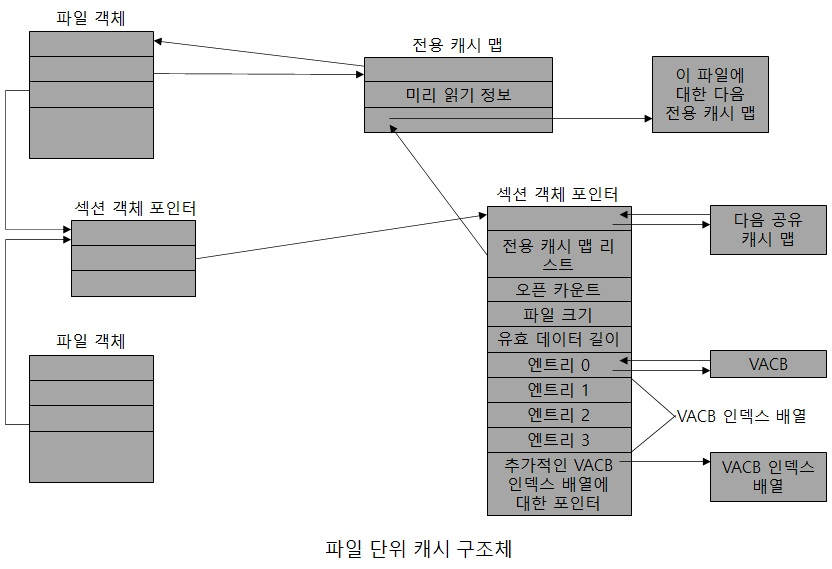
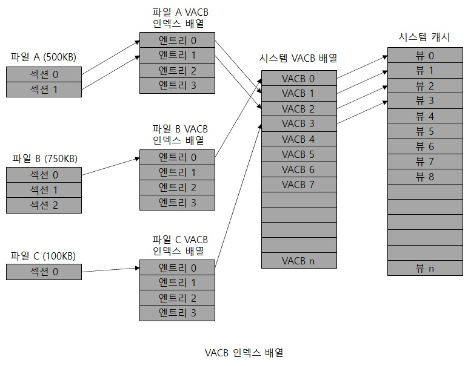

# 파일 단위 캐시 데이터 구조체

파일 오픈되어 있을 시 해당 파일의 핸들은 파일 객체를 가집니다.  
그리고 이 파일이 캐시되었다면 파일 객체는 최근 2회 읽기에 대한 위치를 포함하고 있는  
전용 캐시 맵(Private Cache Map) 구조체를 가리키게 되며,   
이로 인하여 캐시 매니져는 지능형 미리 읽기가 가능합니다.  
그리고 파일의 열려있는 인스턴스에 대한 모든 전용 캐시 맵은 서로 연결되어 있습니다.  
캐시된 각 파일은 공유 캐시 맵(Shared Cache Map) 구조체를 가지며, 이 구조체는 캐시된 파일의  
크기와 유효 데이터의 길이를 포함해 캐시된 파일의 상태를 나타냅니다.  

공유 캐시 맵은 섹션 객체, 해당 파일과 연관된 전용 캐시 맵 리스트, 시스템 캐시에 있는  
현재 파일의 매핑된 뷰들을 기술하는 VACB를 가리킵니다.  
따라서 캐시 매니져는 요청된 주소에 해당하는 파일의 뷰가 시스템 캐시에 매핑되어 있는지  
파악해야 하며, VACB가 요구된 파일 오프셋을 갖고 있지 않으면 요청된 데이터는   
현재 캐시에 매핑되어 있지 않은 상태입니다.  

  

캐시 매니져는 파일의 어떤 뷰들이 캐시에 매핑되어 있는지 관리하기 위해  
VACB 인덱스 배열 이라는 것을 가지고 있습니다.  
VACB 인덱스 배열의 첫번째 엔트리는 파일의 처음 256KB를 참조하고,  
두번째 엔트리는 파일의 두번째 256KB를 참조하는 방식으로 배열이 계속 이어져 있습니다.  
그리고 요청 된 데이터가 캐시에 매핑돼 있는지 확인하기 위해 해당 파일의 VACB 인덱스 배열에서  
부합하는 엔트리를 탐색하며, 해당 배열 엔트리가 0이 아니면 요청 된 데이터가 캐시에 존재함을 의미합니다.  
그리고 이 VACB가 파일의 해당 뷰가 매핑되어 있는 시스템 캐시의 위치를 가리킵니다.  
만약 배열 엔트리가 0인 경우 캐시 매니져는 요청된 뷰를 매핑하기 위해   
시스템 캐시에서 프리 슬롯을 찾아야 하며 프리 VACB도 찾아야 합니다.  

  

크기 최적화를 위해 공유 캐시 맵은 4개의 배열 엔트리를 갖는 한개의 VACB 인덱스 배열을 가집니다.  
각 VACB는 256KB에 해당하므로 이런 고정된 크기의 작은 인덱스 배열은 최대 1MB 크기의 파일을  
나타낼 수 있는 VACB 배열 엔트리들을 가리킬 수 있습니다.  
또한 파일이 1MB보다 큰 경우 별도의 VACB 인덱스 배열이 넌페이지드 풀로부터 할당을 받습니다.  
그리고 공유 캐시맵이 이 별도의 데이터 구조체를 가리키게 됩니다.  

참고 문헌 : Windows Internals
